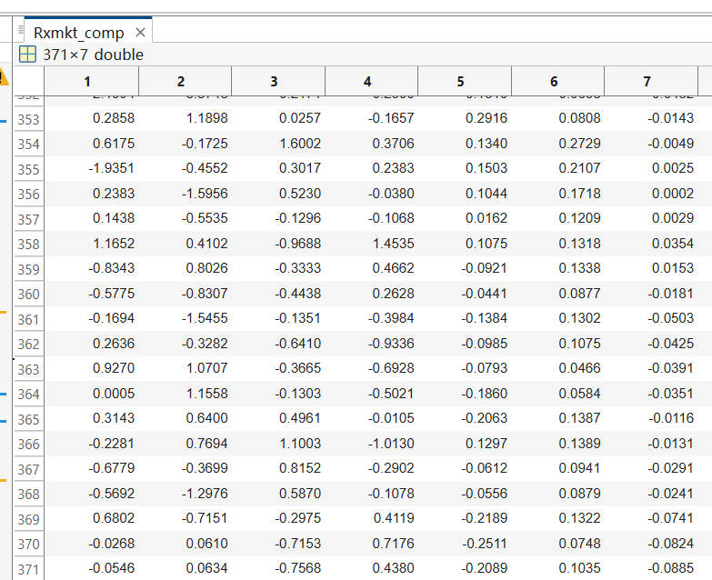

# 20241113 阶段工作总结

使用 python 复现 spectral factor models，目前代码已经跑通，但是结果并不完全一致，在尝试进一步修改的过程中，发觉对于方法论的理解还不够深入，想要深入频率领域则不能浅尝辄止，以跑通为目的。以下是在尝试理解方法论过程中的学习内容。

## Wavelet Transform

- High frequencies: Good time resolution, poor frequency resolution
- Low frequencies: Good frequency resolution, poor time resolution

不同于傅里叶变换假设正弦波会延长到无穷时间，小波变换假设 wavelet 的存在时间是有限的，因而可以通过 wavelet 去捕捉只是暂时存在过的 feature。也正是因为傅里叶分解的这一假设，所以并不能准确的时域信息，这也是小波变换相比傅里叶的最大优势。

wavelet 其实叫做 **local** wavelet 更合适，因为 wavelet 不会在时域中永久存在。以下是常用的几种 wavelet

wavelet 还可以被移动，或是拉长与压缩，前一种（b）对的术语是 location，后一种（c）对应的术语是 **Scale**。

If the wavelet matches the shape of the signal well at a specific scale and location, a large transform value is obtained, otherwise a small transform value is obtained. **The transform is computed at various locations of the signal and for various scales of the wavelet**.

所以在一开始，会有一个最基础的 wavelet，叫做 **mother wavelet**，然后通过 translation parameter $b$ 改变其位置，通过 dilation parameter (**Scale**) $a$ 伸缩其大小，所以小波函数的具体形式可以写为

$$
\psi_{a,b}(t)=\frac1{\sqrt{a}}\psi\left(\frac{t-b}a\right)
$$

**Importantly**，用以控制 scale 的参数与频率相关，这一点通过上面的例子也可以比较清楚的看出来

$$
\mathbf{Frequency} \propto \mathbf{\frac{1}{Scale}}
$$

- Smaller scales: Higher frequency
- Larger scales: Lower frequency

确定了基函数之后，类似于傅里叶的方式进行卷积

$$
F(b, a) = \frac{1}{\sqrt{a}} \int_{-\infty}^{\infty} f(t) \psi^* \left( \frac{t - b}{a} \right) dt
$$

需要注意的是，这个卷积是对时间 $t$ 的卷积，举例来说效果如图

在离散小波变换 (Discrete Wavelet Transform, DWT) 中，我们需要对 $a,b$ 不断采样，为了使得步长不受 scale 的影响，小波函数设置为

$$
\psi_{m,n}(t)=\frac1{\sqrt{a_0^m}}\psi\Bigg(\frac{t-nb_0a_0^m}{a_0^m}\Bigg)
$$

所以最终小波变换表达为

$$
T_{m,n} =\langle x,\psi_{m,n}\rangle =\int_{-\infty}^\infty x(t) \frac{1}{a_0^{m/2}} \psi(a_0^{-m}t-nb_0) \mathrm{d}t
$$

其中 $T_{m,n}$ 被称之为 **wavelet coefficients** or **detail coefficient**.

Common choices for discrete wavelet parameters $a_0$ and $b_0$ are 2 and 1 respectively. This power-of-two logarithmic scaling of both the dilation and translation steps is known as the **dyadic grid arrangement**.

代入后 dyadic grid wavelet 可写为

$$
\psi_{m,n}(t)=2^{-m/2}\psi(2^{-m}t-n)
$$

Discrete dyadic grid wavelets are commonly chosen to be orthonormal. These wavelets are both orthogonal to each other and normalized to have unit energy, which can be expressed as

$$
\int_{-\infty}^{\infty}\psi_{m,n}(t)\psi_{m',n'}(t) \mathrm{d}t=\begin{cases} 1&\text{if }m=m'\mathrm{~and~}n=n'\\ 0&\text{otherwise}\end{cases}
$$

那么 DWT 写为

$$
T_{m,n}=\int_{-\infty}^{\infty}x(t)\psi_{m,n}(t) \mathrm{d}t
$$

Inverse DWT 为

$$
x(t)=\sum_{m=-\infty}^\infty\sum_{n=-\infty}^\infty T_{m,n}\psi_{m,n}(t)
$$

### The scaling function and the multiresolution representation

接下来会引入一个新的概念，叫做 **scaling functions**，the scaling function is associated with smoothing of the signal and has the same form as the wavelet, given by

$$
\phi_{m,n}(t)=2^{-m/2}\phi(2^{-m}t-n)
$$

and $\int_{-\infty}^{\infty}\phi_{0,0}(t)\mathrm{d}t=1$. The scaling function is orthogonal to translations of itself, **but not to dilations of itself**.

> $\phi_{0,0}(t) = \phi(t) $ is sometimes referred to as the father scaling function or **father wavelet**.

The scaling function can be convolved with the signal to produce **approximation coefficients** as follows:

$$
S_{m,n}=\int_{-\infty}^{\infty}x(t)\phi_{m,n}(t)\mathrm{~d}t
$$

如果 approximation coefficients 只对于 $n$ 进行求和，如下式

$$
x_m(t)=\sum_{n=-\infty}^\infty S_{m,n}\phi_{m,n}(t)
$$

其中 $x_m(t)$ 就是 **smooth, scaling-function-dependent, version of the signal $x(t)$ at scale index $m$**.

因此，$x(t)$ 就可以表示为 approximation coefficients 和 wavelet coefficients 的加和：

$$
x(t)=\sum_{n=-\infty}^\infty S_{m_{0,n}}\phi_{m_{0,n}}(t)+\sum_{m=-\infty}^{m_0}\sum_{n=-\infty}^\infty T_{m,n}\psi_{m,n}(t)
$$

此处的加和非常值得注意，**是任意的 scale index $m_0$，以及从 $m_0$ 到 negative infinity signal detail 的加和**。

如果将 signal detail 表示为 

$$
d_m(t)=\sum_{n=-\infty}^\infty T_{m,n}\psi_{m,n}(t)
$$

那么 $x(t)$ 就可以进一步写为

$$
x(t)=x_{m_0}(t)+\sum_{m=-\infty}^{m_0}d_m(t)
$$

取 $m-1$ 和 $m$ 相减得

$$
x_{m-1}(t)=x_m(t)+d_m(t)
$$

也就是说，相对低频的 ($m$) 的 signal detail + signal smooth 就得到了相对高频 ($m-1$) 的 signal detail，这就是 **multiresolution representation**。

> 借助于 b 站的视频，小波变换基本理解清楚，不过还有待进一步梳理。

## Code explanation

`RedundantHaarIso`

Perform the redundant Haar wavelet transform on 1D data up to level $J$.

**Redundant Haar Wavelet Transform**

Scaling (Low-Pass) Filter $h$:

$$
h=\left[\frac1{\sqrt{2}},\frac1{\sqrt{2}}\right]
$$

Wavelet (High-Pass) Filter $g$:

$$
g=\left[\frac1{\sqrt{2}},-\frac1{\sqrt{2}}\right]
$$

Detail Coefficients $D_j$

$$
D_j[n]=\sum_kg_j[k]\cdot x[n-k]
$$

> used to capture high frequency

Approximation Coefficients $A_j$

$$
A_j[n]=\sum_kh_j[k]\cdot x[n-k]
$$

> used to capture low frequency

$$
x[n] = \sum_j D_j[n] + A_j[n]
$$

## ComputeMVWoldComponentsFromMA

`ComputeMVWoldComponentsFromMA`

- Decompose the shocks and Wold coefficients using redundant Haar wavelet transforms
- Compute the multivariate components at each scale $j$ (from 1 to $J+1$)

**Step 1: Wavelet Transform of Shocks**

For each variable $v$:

- *Perform Redundant Haar Wavelet Transform*

Decompose $\hat{e}_v$ into detial and approximation coefficients at each level $j$ using the redundant Haar wavelet transform.

Detail coefficients $D_j$ and approximation coefficients $A_j$ are obtained.

**Step 2: Wavelet Transform of Wold Coefficients**

For each pair of variables $(v,v')$

- *Transform Wold Coefficients*

Apply the redundant Haar wavelet transform to the reversed Wold coefficients $\Psi_{v,v^{\prime}}$

**Step 3: Compute Components at Each Scale**

For each scale $j$ (from 1 to $J+1$):

- *Extract Wavelet-Transformed Shocks and Coefficients*

Collect the detail coefficients at scale $j$ for both shocks and Wold coefficients.

- *Compute Components*

$$
\mathbf{Y}_{t,v}^{(j)}=\sum_{k=0}^{K-1}\sum_{{v^{\prime}=1}}^{{n_{{\mathrm{vars}}}}}\mathbf{\Psi}_{{v,v^{\prime},k}}^{(j)}\cdot\mathbf{\hat{e}}_{{t-k\cdot2^{j},v^{\prime}}}^{(j)}
$$

## ComputeWoldComponentsFromVAR

`ComputeWoldComponentsFromVAR`

1. Estimate a VAR(p) model on the data
2. Compute the Wold coefficients from the VAR model.
3. Decompose the VAR residuals (shocks) and Wold coefficients using redundat Haar wavelet transforms
4. Compute the multivariate Wold components at different scales

**Step 1: Estimate the VAR(p) Model**

$$
\mathbf{Y}_t=\mathbf{c}+\sum_{i=1}^p\mathbf{A}_i\mathbf{Y}_{t-i}+\mathbf{e}_t
$$

*Estimation Process*

- *Dependent Variable Matrix*

$$
\mathbf{Y}_{{\mathrm{VAR}}}=\begin{bmatrix}\mathbf{Y}_{p+1}\\\mathbf{Y}_{p+2}\\\varvdots\\\mathbf{Y}_{T}\end{bmatrix}
$$

- *Regressor Matrix*

$$
\mathbf{X}_{{\mathrm{VAR}}}=\begin{bmatrix}1&\mathbf{Y}_{p}^{\top}&\mathbf{Y}_{p-1}^{\top}&\ldots&\mathbf{Y}_{1}^{\top}\\1&\mathbf{Y}_{p+1}^{\top}&\mathbf{Y}_{p}^{\top}&\ldots&\mathbf{Y}_{2}^{\top}\\\varvdots&\varvdots&\varvdots&\ddots&\varvdots\\1&\mathbf{Y}_{T-1}^{\top}&\mathbf{Y}_{T-2}^{\top}&\ldots&\mathbf{Y}_{T-p}^{\top}\end{bmatrix}
$$

- *OLS Estimation*

$$
\hat{\boldsymbol{\beta}}=(\mathbf{X}_{\mathrm{VAR}}^{\top}\mathbf{X}_{\mathrm{VAR}})^{-1}\mathbf{X}_{\mathrm{VAR}}^{\top}\mathbf{Y}_{\mathrm{VAR}}
$$

> $\hat{\beta}$ includes the estimates of $c$ and $A_i$

- *Extracting Constant Term and get residuals*

$$
\hat{\mathbf{c}}=\hat{\boldsymbol{\beta}}_{0}, \quad \hat{\mathbf{e}}_t=\mathbf{Y}_t-\hat{\mathbf{c}}-\sum_{i=1}^p\hat{\mathbf{A}}_i\mathbf{Y}_{t-i}
$$

**Step 2: Compute the Wold Coefficients**

The Wold representation expresses a stationary time series as an infinite moving average (MA) of its innovations:

$$
\mathbf{Y}_{t}=\boldsymbol{\mu}+\sum_{k=0}^{\infty}\boldsymbol{\Psi}_{k}\mathbf{e}_{t-k}
$$

*Companion Form Representation*

- *Companion Matrix*

$$
\mathbf{M}=\begin{bmatrix}\hat{\mathbf{A}}_{1}&\hat{\mathbf{A}}_{2}&\ldots&\hat{\mathbf{A}}_{p}\\\mathbf{I}&\mathbf{0}&\ldots&\mathbf{0}\\\mathbf{0}&\mathbf{I}&\ldots&\mathbf{0}\\\varvdots&\varvdots&\ddots&\varvdots\\\mathbf{0}&\mathbf{0}&\ldots&\mathbf{I}\end{bmatrix}
$$

- *Compute Wold Coefficients*

$$
\boldsymbol{\Psi}_{k}=\mathbf{M}^{k}\begin{bmatrix}\mathbf{I}\\\mathbf{0}\\\varvdots\\\mathbf{0}\end{bmatrix}
$$

**Step 3: Compute Components Using Wavelet Transforms**

- *Residual (Shocks)*

The residual $\hat{e}_t$ are treated as shocks to the system.

- *Compute Components*

Use the function `ComputeMVWoldComponentsFromMA` to compute the components at different scales using the Wold coefficients and residuals.

## TODO

1. wold 分解，为什么有两个变量，目标变量和冲击变量之间的区分是什么
2. extend wold 相比于 wold extend 在了什么地方
3. 残差解释的话，是不是相当于没有利用到原本的信息？

<!-- 

 -->

