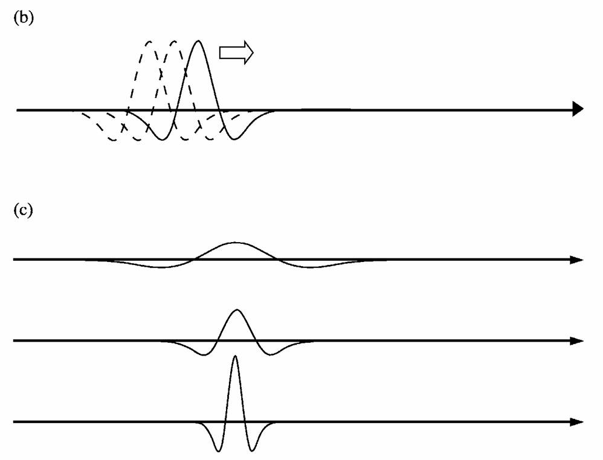
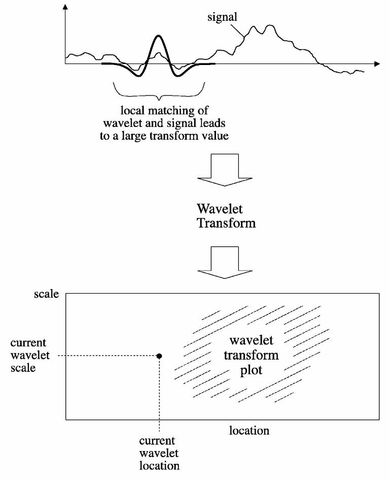
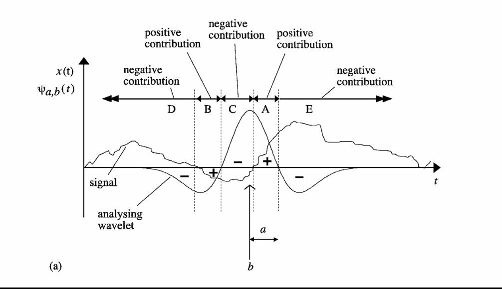

# 20241117 阶段工作总结

## Time-Frequency Uncertainty principles

在时频分析中，存在一个基本的不确定性原理，即如果我们对时域信息越**确定**，则对频域信息越**不确定**，反之亦然，我们永远不可能对时域信息和频域信息都确定。这个确定指的是**在时域上以 $t$ 为随机变量的分布和在频域上以 $f$ 为随机变量的分布集中情况**。

**当一个信号观测时间越短（分布越集中），其频域范围就越广（分布越分散）。** 以时域为例，分布范围越集中，我们就越确定峰值出现在某一时刻的概率，无论时域还是频域，我们都希望更加确定地知晓其分布情况。

**Heisenberg uncertainty principle**

时频不确定性其实就是海森堡不确定性原理。一个粒子的位置越确定，它的动量就越不确定。在量子力学中，粒子的动量是由其波长决定的，而波长又由频率决定，所以粒子的动量就正比于其波函数的频率。因此，一个粒子的位置越确定，其波函数就越集中，所以波函数的频谱就越分散，动量就越不确定。

以下图为例，当一个信号存在时间越短（时域分布越集中），那么对应在频域上的分布就会越广。极端情况就是只集中于一个点，那么此时频域分布会达到最分散的情况，也就是均匀分布。

相同的波持续的存在，达到的也是相同的效果。

### Mathematically demonstration

$$
\left( \int_{-\infty}^{\infty} x^2 |f(x)|^2 \, dx \right) \left( \int_{-\infty}^{\infty} \omega^2 |\hat{f}(\omega)|^2 \, d\omega \right) \geq \frac{1}{16\pi^2}.
$$

一般来说，随机变量 $X$ 的概率密度函数通常表示为 $p(x)$，满足以下性质

- $p(x) \geq 0$
- $\int_{-\infty}^{\infty}p(x)dx =1$

但是对于信号或波函数（量子力学领域），通常可以将 $|f(x)|^2$ 是作为概率密度函数，这是因为

- $|f(x)|^2 \geq 0$
- $|f(x)|^2$ 表示在位置 $x$ 处的强度或能量密度 

那么当均值为零时，这两项实际上衡量了在时域和频域的方差，也就是分布情况，这个不等式所要求的就是，**无法同时在时域和频域上取得极度精确的分布**。

傅里叶变换假定正弦波在周期中永久存在，因此在时域上非常不确定，丢失了时域的信息（localize the Frourier transform），因此引入了 wavelet transform，**fundamental tradeoff between the simultaneously attainable resolutions in the time and frequency domains**.

## Wavelet Transform

不同于傅里叶变换假设正弦波会延长到无穷时间，小波变换假设 wavelet 的存在时间是有限的，因而可以通过 wavelet 去捕捉 transient feature。

wavelet 其实是 **local** wavelet，因为 wavelet 不会在时域中永久存在。以下是常用的几种 wavelet

wavelet 还可以被移动，或是拉长与压缩，前一种（b）对的术语是 location，后一种（c）对应的术语是 **Scale**。

If the wavelet matches the shape of the signal well at a specific scale and location, **a large transform value is obtained**, otherwise a small transform value is obtained. **The transform is computed at various locations of the signal and for various scales of the wavelet**.

所以在一开始，会有一个最基础的 wavelet，叫做 **mother wavelet**，然后通过 translation parameter $b$ 改变其位置，通过 dilation parameter (**Scale**) $a$ 伸缩其大小，所以小波函数的具体形式可以写为

$$
\psi_{a,b}(t)=\frac1{\sqrt{a}}\psi\left(\frac{t-b}a\right)
$$

**Importantly**，用以控制 scale 的参数与频率相关，这一点通过上面的例子也可以比较清楚的看出来

$$
\mathbf{Frequency} \propto \mathbf{\frac{1}{Scale}}
$$

- Smaller scales: Higher frequency
- Larger scales: Lower frequency

确定了基函数之后，类似于傅里叶的方式进行卷积

$$
F(b, a) = \frac{1}{\sqrt{a}} \int_{-\infty}^{\infty} f(t) \psi^* \left( \frac{t - b}{a} \right) dt
$$

需要注意的是，这个卷积是对时间 $t$ 的卷积，举例来说效果如图

在离散小波变换 (Discrete Wavelet Transform, DWT) 中，我们需要对 $a,b$ 不断采样，为了使得步长不受 scale 的影响，小波函数设置为

$$
\psi_{m,n}(t)=\frac1{\sqrt{a_0^m}}\psi\Bigg(\frac{t-nb_0a_0^m}{a_0^m}\Bigg)
$$

所以最终小波变换表达为

$$
T_{m,n} =\langle x,\psi_{m,n}\rangle =\int_{-\infty}^\infty x(t) \frac{1}{a_0^{m/2}} \psi(a_0^{-m}t-nb_0) \mathrm{d}t
$$

其中 $T_{m,n}$ 被称之为 **wavelet coefficients** or **detail coefficient**.

**Common choices** for discrete wavelet parameters $a_0$ and $b_0$ are 2 and 1 respectively. This power-of-two logarithmic scaling of both the dilation and translation steps is known as the **dyadic grid arrangement**.

代入后 dyadic grid wavelet 可写为

$$
\psi_{m,n}(t)=2^{-m/2}\psi(2^{-m}t-n)
$$

Discrete dyadic grid wavelets are commonly chosen to be orthonormal. These wavelets are both orthogonal to each other and normalized to have unit energy, which can be expressed as

$$
\int_{-\infty}^{\infty}\psi_{m,n}(t)\psi_{m',n'}(t) \mathrm{d}t=\begin{cases} 1&\text{if }m=m'\mathrm{~and~}n=n'\\ 0&\text{otherwise}\end{cases}
$$

那么 DWT 写为

$$
T_{m,n}=\int_{-\infty}^{\infty}x(t)\psi_{m,n}(t) \mathrm{d}t
$$

Inverse DWT 为

$$
x(t)=\sum_{m=-\infty}^\infty\sum_{n=-\infty}^\infty T_{m,n}\psi_{m,n}(t)
$$

### The scaling function and the multiresolution representation

接下来会引入一个新的概念，叫做 **scaling functions**，the scaling function is associated with smoothing of the signal and has the same form as the wavelet, given by

$$
\phi_{m,n}(t)=2^{-m/2}\phi(2^{-m}t-n)
$$

and $\int_{-\infty}^{\infty}\phi_{0,0}(t)\mathrm{d}t=1$. The scaling function is orthogonal to translations of itself, **but not to dilations of itself**.

> $\phi_{0,0}(t) = \phi(t) $ is sometimes referred to as the father scaling function or **father wavelet**.

The scaling function can be convolved with the signal to produce **approximation coefficients** as follows:

$$
S_{m,n}=\int_{-\infty}^{\infty}x(t)\phi_{m,n}(t)\mathrm{~d}t
$$

如果 approximation coefficients 只对于 $n$ 进行求和，如下式

$$
x_m(t)=\sum_{n=-\infty}^\infty S_{m,n}\phi_{m,n}(t)
$$

其中 $x_m(t)$ 就是 **smooth, scaling-function-dependent, version of the signal $x(t)$ at scale index $m$**.

因此，$x(t)$ 就可以表示为 approximation coefficients 和 wavelet coefficients 的加和：

$$
x(t)=\sum_{n=-\infty}^\infty S_{m_{0,n}}\phi_{m_{0,n}}(t)+\sum_{m=-\infty}^{m_0}\sum_{n=-\infty}^\infty T_{m,n}\psi_{m,n}(t)
$$

此处的加和非常值得注意，**是任意的 scale index $m_0$，以及从 $m_0$ 到 negative infinity signal detail 的加和**。

如果将 signal detail 表示为 

$$
d_m(t)=\sum_{n=-\infty}^\infty T_{m,n}\psi_{m,n}(t)
$$

那么 $x(t)$ 就可以进一步写为

$$
x(t)=x_{m_0}(t)+\sum_{m=-\infty}^{m_0}d_m(t)
$$

取 $m-1$ 和 $m$ 相减得

$$
x_{m-1}(t)=x_m(t)+d_m(t)
$$

也就是说，相对低频的 ($m$) 的 signal detail + signal smooth 就得到了相对高频 ($m-1$) 的 signal detail，这就是 **multiresolution representation**。

