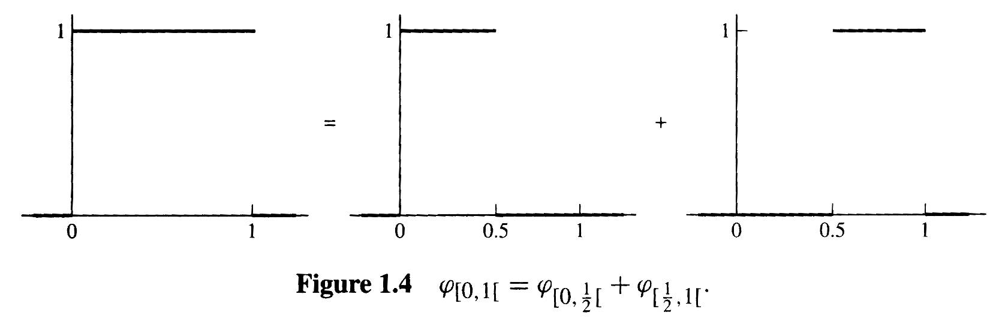
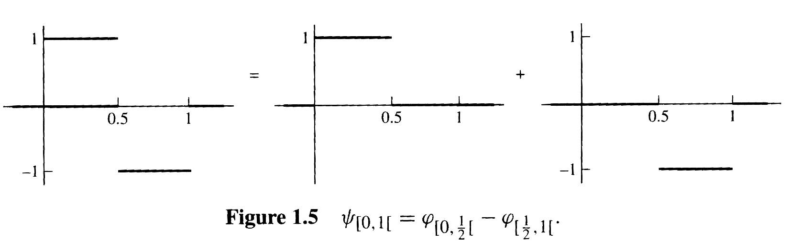
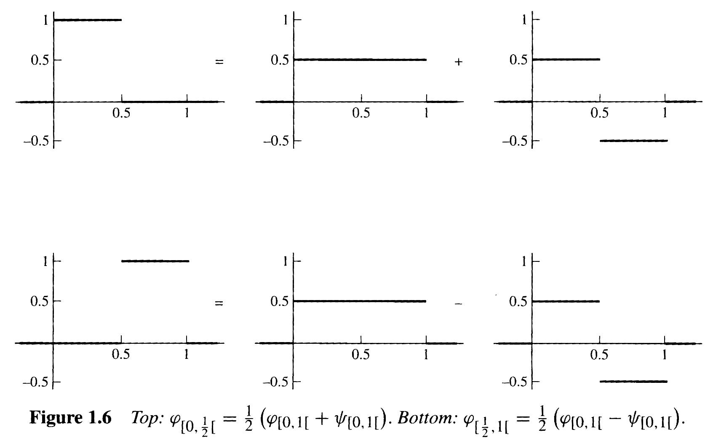

# 20241120 阶段工作总结

## Time-Frequency Uncertainty principles

### Proof of Lower bound

$$
\sigma_t \sigma_f \geq \frac{1}{4\pi}
$$

对于一个归一化信号 $x(t)$，有

$$
\int_{-\infty}^{\infty} |x(t)|^2 dt = 1
$$

时域均值和标准差分别为

$$
\mu_t = \int_{-\infty}^{\infty} t |x(t)|^2 dt , \quad \sigma_t = \sqrt{\int_{-\infty}^{\infty}(t - \mu_t)^2 |x(t)|^2 dt }
$$

这里 $\mu_t$ 得到的是信号能量分布在时间上的均值，表示的是信号能量在时间上的中心位置，即信号能量主要集中在哪个时间点。举例来说，对于冲激函数 $x(t)=\delta(t-t_0)$，有

$$
\mu_t = \int_{-\infty}^{\infty} t \cdot |\delta(t-t_0)|^2 dt = t_0
$$

同理，频率均值和标准差为

$$
\mu_f = \int_{-\infty}^{\infty} f |X(f)|^2 df, \quad \sigma_f = \sqrt{\int_{-\infty}^{\infty}(f - \mu_f)^2 |X(f)|^2 dt }
$$

其中 $X(f)=\int_{-\infty}^{\infty} x(t) e^{-2\pi i ft}dt $，在下文推导时，为方便计算，令 $\mu_t = \mu_f = 0$。对于实值信号来说，$|X(f)|^2$ 关于零频率对称，所以频率均值通常为零。

> [!TIP|label:Fourier transform of Derivatives]
$$
f'(x) = \frac{d}{dt} \left[\int_{-\infty}^{\infty} X(f) e^{i 2\pi ft}df \right] = \int_{-\infty}^{\infty} i2\pi f X(f) e^{i 2\pi ft}df
$$
> 因此 $f'(x)$ 对应的傅里叶系数为 $G(f) = i2\pi fX(f)$，这也说明傅里叶变换的结果为
$$
i 2\pi f X(f) = \int_{-\infty}^{\infty} f'(x) e^{-i2\pi ft}dt
$$
> 

此时需要引入一个统计量 $Q$，用以衡量信号导数的能量

$$
Q = \int_{-\infty}^{\infty} |\frac{d}{dt}x(t)|^2 dt
$$

根据 Parseval's theorem 有

$$
Q = \int_{-\infty}^{\infty} |\frac{d}{dt}x(t)|^2 dt = \int_{-\infty}^{\infty} |i2\pi X(f)|^2 df = (2\pi)^2 \int_{-\infty}^{\infty} f^2 |X(f)|^2 df = (2\pi)^2 \sigma_f^2
$$

令 $u(t) = (t - \mu_t) x(t),\ v(t) = \frac{dx(t)}{dt} $，则

$$
\begin{aligned}
||u||^2 &= \int_{-\infty}^{\infty} |u(t)|^2 dt = \int_{-\infty}^{\infty} (t - \mu_t)^2 |x(t)|^2 dt = \sigma_t^2 \\
||v||^2 &= \int_{-\infty}^{\infty} |v(t)|^2 dt = \int_{-\infty}^{\infty} |\frac{dx(t)}{dt}|^2 dt = Q
\end{aligned}
$$

二者内积为

$$
\langle u,v \rangle = \int_{-\infty}^{\infty} u(t) \overline{v(t)} dt  = \int_{-\infty}^{\infty} (t-\mu_t)x(t)\frac{\overline{dx(t)}}{dt} dt$$

根据柯西施瓦兹不等式有

$$
||u||^2 ||v||^2  = \sigma^2_t Q \geq |\langle u,v \rangle|^2
$$

一通猛算下来，$ |\langle u,v \rangle|^2 \geq \frac{1}{4} $，因此带入移项得

$$
\sigma_t^2 \sigma_f^2 \geq \frac{1}{16 \pi^2}
$$

因此，这个不等式实际上刻画了**时域能量分布和频域能量分布之间的关系**。对于特例，如只在 $t=0$ 处有值的 Dirac 函数和无穷延伸的周期函数，这些函数并不属于平方可积函数，即能量有限的信号。

### 傅里叶变换的标度特性

对于信号 $x(t)$ 进行傅里叶变换有

$$
\hat{X}(f) = \int_{-\infty}^{\infty} x(t) e^{-2\pi ift} dt
$$

当在时域中对信号进行缩放处理时，$h(t) = x(at), \ a>0$，频域上的变化为

$$
\begin{aligned}
   \hat{X}_h (f) &= \int_{-\infty}^{\infty} x(at) e^{-2\pi i ft} dt \\
   &= \frac{1}{a} \int_{-\infty}^{\infty} x(u) e^{-2\pi i (f/a) u} du \\
   &= \frac{1}{a} \hat{X}(\frac{f}{a})
\end{aligned}
$$

$a$ 为负时同理，因此最终为

$$
\hat{X}_h(s) = \frac{1}{|a|} \hat{X}(\frac{f}{a})
$$

> $a$ 取负意味着在时间轴上信号被反转。

这被称为傅里叶变换的**标度特性**，这意味着，如果在时间上压缩信号，相当于在频率空间上扩展信号，反之亦然。

**与不等式的结合**

原本的概率密度函数为

$$
p(t) = \frac{|x(t)|^2}{E}
$$

其中 $E = \int_{-\infty}^{\infty} |x(t)|^2 dt = 1 $。因为 $E' = \int_{-\infty}^{\infty} |x(at)|^2 dt = \frac{1}{a}E = \frac{1}{a} $，所以缩放后的概率密度函数为

$$
p'(t) = \frac{|x(at)|^2}{E'} = a|x(at)|^2
$$

缩放后的均值为

$$
\mu_t' = \int_{-\infty}^{\infty} tp'(t)dt = \int_{-\infty}^{\infty} t a|x(at)|^2 dt = \frac{1}{a} \int_{-\infty}^{\infty} u|x(u)|^2 du = \frac{1}{a} \mu_t
$$

因此缩放后的标准差为

$$
\begin{aligned}
\sigma_t^{2 \prime} &= \int_{-\infty}^{\infty} (t - \mu_t')^2 p'(t) dt= \int_{-\infty}^{\infty} (t-\frac{\mu_t}{a})^2a|x(at)|^2dt \\
\end{aligned}$$

令 $u=at, t = \frac{u}{a}$，则

$$
\sigma_t^{2 \prime} = \int_{-\infty}^{\infty} (\frac{u}{a} - \frac{\mu_t}{a})^2 a |x(u)|^2 d \frac{u}{a} = \frac{1}{a^2} \int_{-\infty}^{\infty} (u - \mu_t)^2 |x(u)|^2 du = \frac{1}{a^2}\sigma_t^2
$$

因为时域能量等于频域能量，所以在频域中概率密度同样为

$$
p'(f) = a|X_h(f)|^2 = a |\frac{1}{a} X(\frac{f}{a}) |^2 = \frac{1}{a} |X(\frac{f}{a})|^2
$$

则频域均值为

$$
\mu_f' = \int_{-\infty}^{\infty} f p'(f)df = \int_{-\infty}^{\infty}f \frac{1}{a}|X(\frac{f}{a})|^2 df
$$

令 $u = \frac{f}{a}$，则有

$$
\mu_f' = a \int_{-\infty}^{\infty}u |X(u)|^2 du = a \mu_f 
$$

所以频域标准差为

$$
\sigma_f^{2\prime} = \int_{-\infty}^{\infty} (f - \mu_f')^2 p'(f) df = \int_{-\infty}^{\infty} (f - a\mu_f)^2 \frac{1}{a}|X(u)|^2 df
$$

令 $u = \frac{f}{a}$，则有

$$
\sigma_f^{2\prime} = \int_{-\infty}^{\infty} (au-a\mu_f)^2 \frac{1}{a} |X(u)|^2 dau = a^2 \sigma_f^2
$$

所以

$$
\sigma_t^{\prime}\sigma_t^{\prime} = (\frac{1}{a}\sigma_t) (a \sigma_f) = \sigma_t \sigma_f
$$

在对时域进行缩放操作时，不会影响不等式的成立，More specifically，**如果时域上的能量密度分布收缩，那么频域上的能量密度就会扩张**。

### 离散情况

上述的所有推导都是基于连续情况进行的，在离散情况下，会有些不同。

因为在离散傅里叶变换 (Discrete Fourier Transform, DFT)，

$$
X[k] = \sum_{n=0}^{N-1} x[n] \cdot e^{-i 2\pi \frac{kn}{N}}, \quad k = 0,1, \cdots N-1
$$

**坐标基的选取只和采样点数 $N$ 有关**。我可以通过提高采样频率和延长采样时间来增加 $N$，例如，对于一个周期为 $2\pi$ 的正弦波，我既可以在一个周期内多采几个点，也可以延长采样时间，例如从一个周期变为两个周期，这两种方式都能增加 $N$ 的个数，但是哪一种对应了时频不确定性？

根据 Nyquist-Shannon Sampling Theorem，只有当采样频率大于信号内最高频率的两倍时，才能唯一复原出对应的 $x(t)$。**所以只有当采样频率提高到足以唯一复原出 $x(t)$ 的程度，再提高采样时间，才是对应了连续情况中的时频不确定性**。

## Wavelet Transform

No frequency information is available in the time-domain signal, and no time information is available in the Fourier transformed signal. The Fourier transform give the frequency information of the signal, which means that it tells us how much of each frequency exists in signal, but it does not tell us **when in time** these frequency components exist. The information is not required when the signal is **stationary**. 

Let's take a closer look at this **stationarity** concept more closely. Signal whose frequency content do not change in time are called **stationary signals**. In this case, one does not need to know **at what times frequency components exist**, since all frequency compnents exist at all times.

以 **Haar Wavelet** 为例，Father wavelet：

$$
\varphi(x)_{(0,1)} =
\begin{cases} 
1, & \text{if } 0 \leq x < 1, \\
0, & \text{otherwise.}
\end{cases}
$$

并且 **wider** father wavelet 可以表示为两个 **narrower** father wavelet 的相加

通过 the **difference** of the two narrower father 可以定义出 mother wavelet

$$
\psi_{(0,1)}(r)=\begin{cases}1&\text{if }0\leq r<\frac12,\\-1&\text{if }\frac12\leq r<1,\\0&\text{otherwise.}\end{cases}
$$

除了通过 narrower 变成 wider

$$
\begin{cases}\varphi_{(0,1)}=\varphi_{(0,\frac{1}{2})}+\varphi_{(\frac{1}{2},1)},\\\psi_{(0,1)}=\varphi_{(0,\frac{1}{2})}-\varphi_{(\frac{1}{2},1)},&\end{cases}
$$

也可以通过 wider 变成 narrower

$$
\begin{cases}\frac12\left(\varphi_{(0,1)}+\psi_{(0,1)}\right)=\varphi_{(0,\frac12)},\\\frac12\left(\varphi_{(0,1)}-\psi_{(0,1)}\right)=\varphi_{(\frac12,1)}.&\end{cases}
$$

对于定义域在 $(0,1)$ 上的函数 $\tilde{f}$，$s$ 表示 wavelet 在该定义域上的取值，如果用定义在 $(0,\frac{1}{2})$ 和 $(\frac{1}{2},1)$ 上的 father wavelet 来拟合这一函数，有

$$
\begin{aligned}
\tilde{f}& :=s_0\cdot\varphi_{(0,\frac12)}+s_1\cdot\varphi_{(\frac12,1)} \\
&=s_0\cdot\frac12\left(\varphi_{[0,1]}+\psi_{(0,1)}\right)+s_1\cdot\frac12\left(\varphi_{(0,1)}-\psi_{(0,1)}\right) \\
&=\frac{s_0+s_1}2\cdot\varphi_{(0,1)}+\frac{s_0-s_1}2\cdot\psi_{(0,1)}.
\end{aligned}
$$

- The number $(s_0 + s_1) /2$ measures the **average** of the function $\tilde{f}$
- The number $(s_0 - s_1) /2$ measures the **change** of the function $\tilde{f}$

