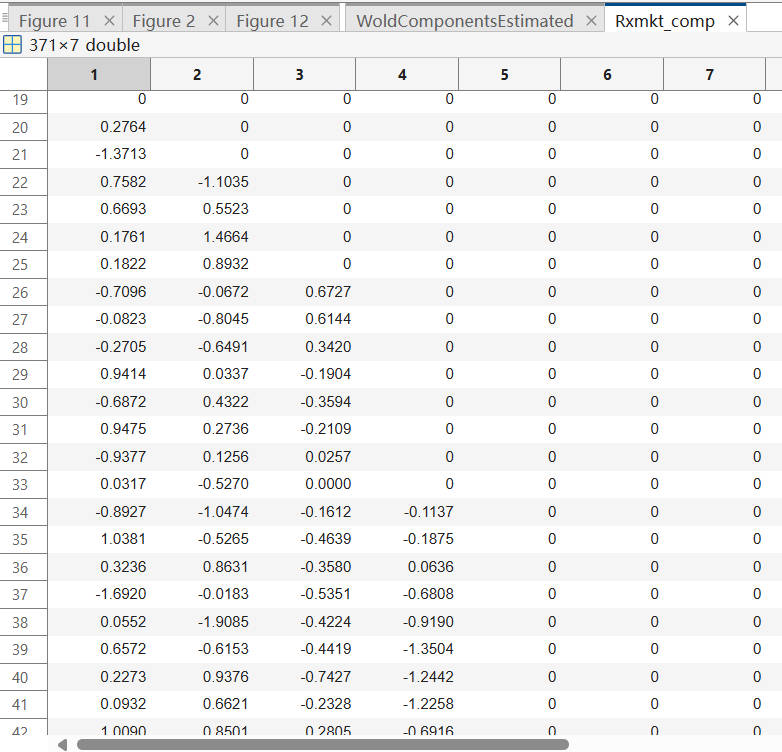
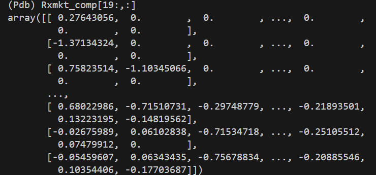

# 20241222 

extended wold representation 的代码已经全部一行一行看过了，对方法论的理解算是比较深了，接下来谈一谈对于思想的理解。

周三的报告中已经指出，EWR 方法与 VAR 的相结合是非常自然的，此外，最重要的是对于输入输出的理解，基本能告诉我们文章作者在干什么事情。在代码实证部分中，主要包括两部分

1. 输入 $T \times 3$ 维矩阵，包括 (Market, test_asset, statevariable)

当 frequency scale 为 $j=6$时，输出维度为 $T \times 3 \times 7$，含义为，对于任意输入变量，我们都可以获得其对应的不同频率分解结果，而不是综合三个变量，得到 $T \times 7$ 维的分解结果。

但是对于最终结果中的三个 $T \times 7$ 维的频率分解结果，它们之间也并非没有联系的，全部的联系都来自于 **VAR 估计过程**。首先残差是根据 VAR 估计出来的， 而他们频率分解结果的不同，是由 VAR 中估计系数的不同导致的。

例如，如果我将 smb 和 hml 用于进行 EWR，对于 smb 来说，频率分解的结果会以 smb 为主，hml 为辅，（假设每个因子自己的 lag 对自己影响更大的情况下），对于 hml 同样如此。所以，一种可能的实现路径就是将 Mkt 和其他因子都放进去，然后根据 Mkt 的频率分解结果为主得到频率成分。

在这部分的实证中，主要是为了选取 test_asset 对应的分解结果。文章选取的是 $5 \times 5$ double sort portfolio 作为 test asset，所以会把上面这个过程重复 25 遍，对于每个 test asset 都得到一个分解结果。

所以这样就限制了该方法的应用范围，不可能对于所有的股票都进行一遍这个过程，维度问题和噪音问题。

2. 输入 $T \times 2$ 维矩阵，包括 (Market, statevariable)

这一部分就近似的实现了在上面所说的流程，只不过选取的不是 factor 而是各种宏观变量，这么做是为了考虑 market 中的可预测性，我想，如果我们试图综合所有宏观变量来增进对于市场的把握，EWR 会是一个不错的方式。

> 宏观变量部分数据还没有，因子部分还需要改为数据库接口，李煌师兄说周一分配任务。

