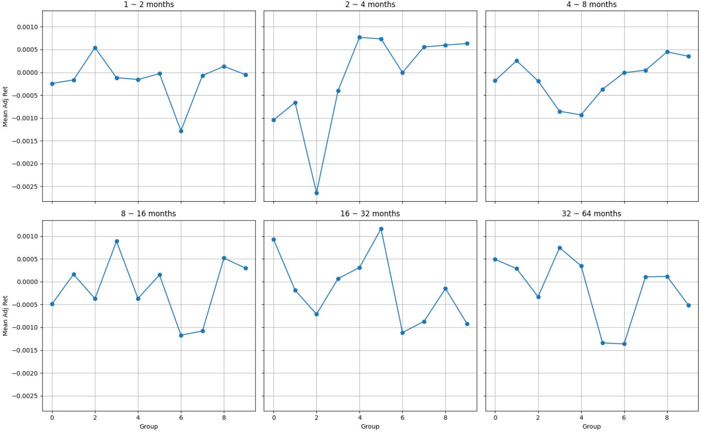

# 20241229

## Relationship

relationship between covariance with expected return, there should be a clear slope, clearer is better

**Fourier way**

- calculate covariance between market and portfolios within different frequency band 
- sort and calculate mean of each group

I do this process for monthly data, therefore the frequency band is 

- low frequency (1 year above)
- middle frequency (2 months ~ 1 year)

**Wold way**

- calculate the market frequency alone
- calculate the covariance relationship for different frequency

I do this process for and monthly data

I use all the 176 portfolios and market to get the market frequency, and use its frequency component to calculate covariance with 176 portfolio's return, and sort.

Coskewness

$$
\hat{\beta}_{\mathrm{SKD}_i}^{(j)}=\frac{E\left[\epsilon_{i,t}^{(j)}\cdot (\epsilon_{M,t}^{(j)})^2\right]}{\sqrt{E\left[(\epsilon_{i,t}^{(j)})^2\right]}E\left[(\epsilon_{M,t}^{(j)})^2\right]}
$$

the calculation of coskewness also uses extended extended Wold representation, which calculates the frequency of test asset by (**test assets, market, statevariable**) and calculates the frequency of market by (**market, statevariable**).

Specifically, $\epsilon_{M,t+1}^{(j)}=(r_{M,t+1}-r_{f,t})^{(j)}-\mu_M^{(j)}$.

