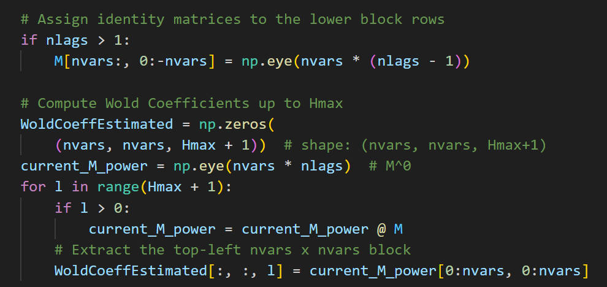
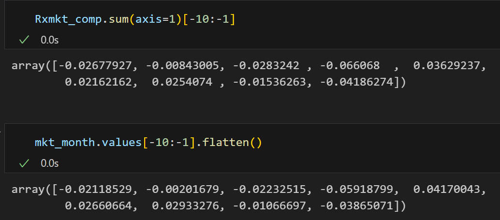
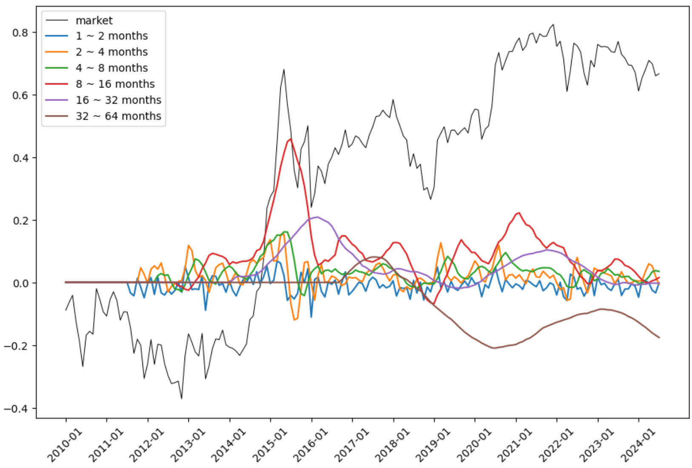
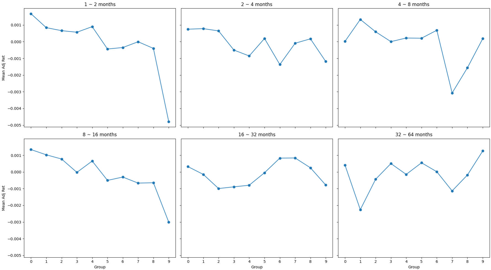
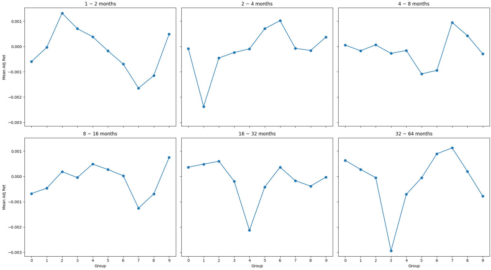
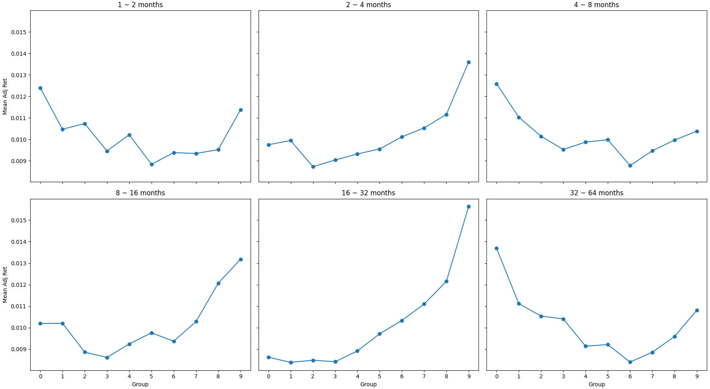
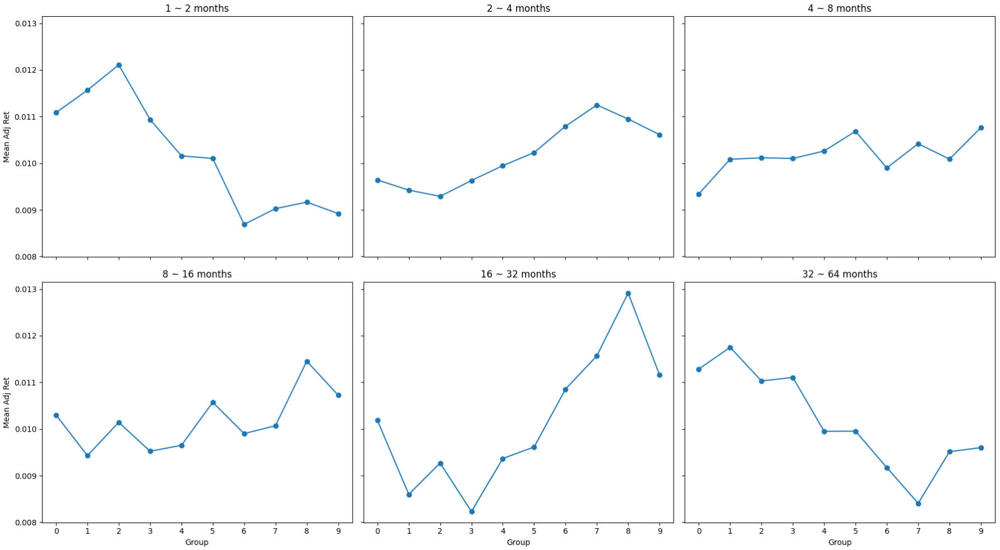

# 20250105

## QA

1. 为什么 $x^{ (j) }_t$ 对应高低频？

$$
x_{t}^{(j)}=\sum_{k=0}^{+\infty}\psi_{k}^{(j)}\varepsilon_{t-k2^{j}}^{(j)},
$$

其中 $\varepsilon_{t-k2^{j}}^{(j)}$ 是代表不同频率的序列，而 $x_{t}^{(j)}$ 表示 $x_{(t)}$ 在 $\varepsilon_{t-k2^{j}}^{(j)}$ 上的投影，因此 $x_{t}^{(j)}$ 表示了不同的频率。 

2. $\varepsilon_t$ 求和能到多久？

$\varepsilon_t$ 的求和阶数与 $x_t$ 的时间长度有关，这是因为 extended wold representation 来自于 VAR 过程，而 $\varepsilon_t$ 与 $x_t$ 的范围有关，如下例

$$
\begin{aligned}
x_t &= A_1 x_{t-1} + A_2 x_{t-2} \\
&= A_1^2 x_{t-2} + A_1 \varepsilon_{t-1} + A_2 x_{t-2} + \cdots \\
&= A_1 \varepsilon_{t-1} + (A_1^2 + A_2)\varepsilon_{t-2} + \cdots
\end{aligned}
$$

## 等价性

对于公式，

$$
x_{t}=\sum_{j=1}^{+\infty} \sum_{k=0}^{+\infty}\psi_{k}^{(j)}\varepsilon_{t-k2^{j}}^{(j)},
$$

当样本中的 $j$ 和 $k$ 均为有限项时，是否等价？从代码的计算过程来说，只考虑了 $\varepsilon$ 的之后阶数和系数，因此忽略了最早的 $x_{t-k}$ ，所以应该是不等价的。

从实际值来看，用求出来的七个频率成分相加，对比原本的时间序列，的确有细微的差别

## Empirical

先对 market 单独进行分解，对分解后得到的各成分计算 **cumulative return**，观察趋势

covariance with portfolio

covariance ratio with portfolio

> 分母加上最后 $j=7$ 这一项后没什么变化。 

covariance with stock 

> drop stock less than 10 years

covariance ratio with stock

对于股票来说再加上 $j=7$ 后也仅有微小变化。

> 目前有一个问题就是这些 test 都是样本内的解释效果，并不同于样本外的 sort and calculate return。
>
> 对于 portfolio 来说，没有什么问题，但是对于 stock 来说，会有 survival bias 的问题。也许是考虑到了这一点，文章作者没有对股票进行实证。

## qlib

Wold 和 frequency factor 还有一个区别在于是否进行平滑操作，这一部分的实证中均没有进行三天平滑。

- 一方面来说 frequency factor 不做平滑就没效果
- 另一方面来说 Wold 需要应用 VAR，加上平滑后会 distort VAR 的结果

目前得到的实证结果都非常差，Sharpe ratio 鲜有正值，stock covariance 和 covariance ratio 都做了。

## Insights

由此引出的一些思考。

1. 回过头再来思考 Extended Wold Representation，实际上只要你有一个 data generating function，就可以对其中的组成成分进行 Haar Transformation 得到不同频率成分。关于 data generating function，这也是 EWR 方法不同于普通傅里叶方法的一点

> Second, contrary to analogous orthogonal representations using discrete Fourier transforms, the decomposition will be shown to be **a general property of the data generating process** (with implications in terms of applicability and interpretability) **rather than a property of the transformed data**.

2. 目前了解到的频率方法的应用，甚至都不能算是一个策略。

- 对于 frequency factor，是在通过 long-short 交易一个因子，后续用 EWR 方法试图代替傅里叶方法得到的频率成分，但是也是在交易因子
- EWR 得到了不同的频率成分，但是用于样本内的解释，这些频率成分有一个共同的特点就是 non-tradable

所以该如何应用这些频率？像是一些 **feature**。或者说，该如何以频率的结果构建策略？

