# 20250108

- VAR 的**数据量越多**，效果越好
- AIC，BIC 等信息准则的加入能够**提升 VAR 的估计效果**，最终提升效果
- 论文中多头组的夏普也只有 0.15，目前复现结果中最好的是 long-only **0.5**
- 加上 statevariable 后（SMB）反而**削弱了策略表现**
- 操作中需要对 market 分解频率进行 demean，demean 60 月（数据长度 150 月）得到了最好的效果 **0.5**，demean 150 月反而降低了模型表现 **0.45**

## Empirical

**不再交易全部股票，改为 long-short 两组**

不好使

**低频率 每年 rolling**

不好使

**Coskewness**

J=2 好使，sharpe 0.5，

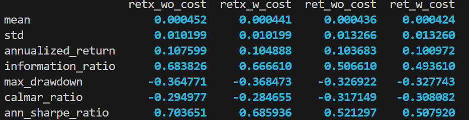

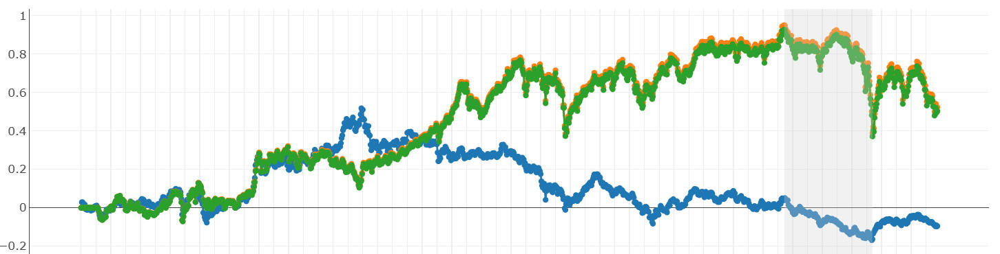

不过根据论文结果是 1 和 2 好使，

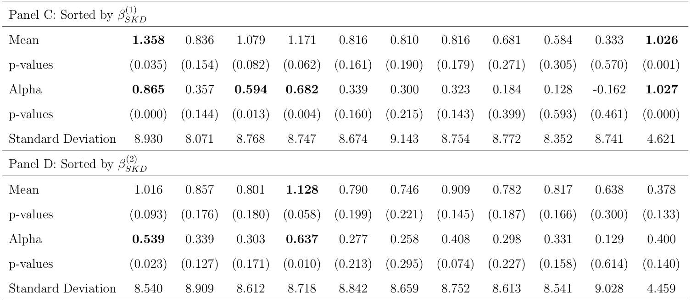

经检查，论文中使用的窗口是 60 月，我现在用的是 150 月，是样本容许的最大数据量，改为 60 months 后，变差了

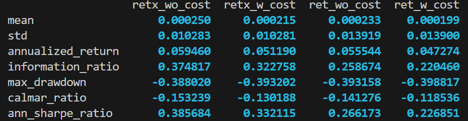

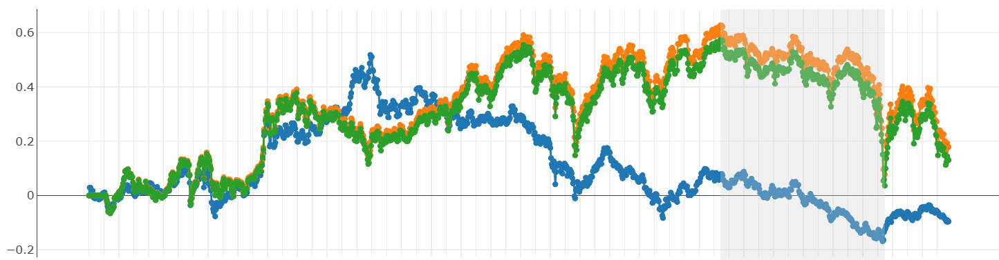

data 长度的区别是，论文 test 选择了 2000-01 ~ 2022-12，我是 2019-06 ~ 2024-06。

使用 IC 选择最好的 lag 阶数后：

- **AIC** (Akaike Information Criterion): Balances model fit and complexity, generally prefers models with more parameters.

$$
\mathcal{AIC} = 2k - 2\ln (L)
$$

where $K$ is the number of estimated parameters, and $L$ is the maximum likelihood of the model

- **BIC** (Bayesian Information Criterion): Similar to AIC but imposes a larger penalty for models with more parameters, often resulting in simpler models.

$$
\mathcal{BIC} = \ln(n) k - 2\ln (L)
$$

- **HQIC** (Hannan-Quinn Information Criterion): Another alternative that provides a balance between AIC and BIC.

$$
\mathcal{HQIC} = 2k \ln(\ln(n)) - 2\ln (L)
$$

> 初步 test，当 max_lag = 18 时，bic 会选择 lag = 2，aic 会选择 lag = 18，hqic 会选择 18

**bic**

实证结果显示，基本都会选择最小的

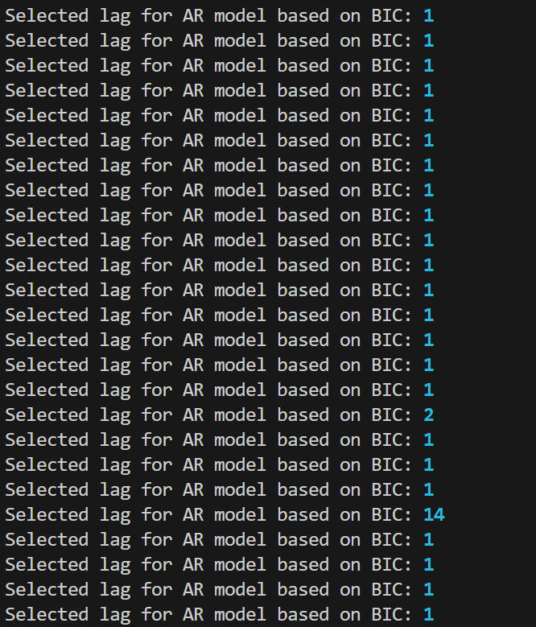

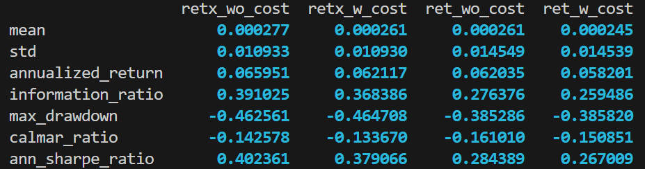

**aic**

AIC 大 lag 的几率会高一些

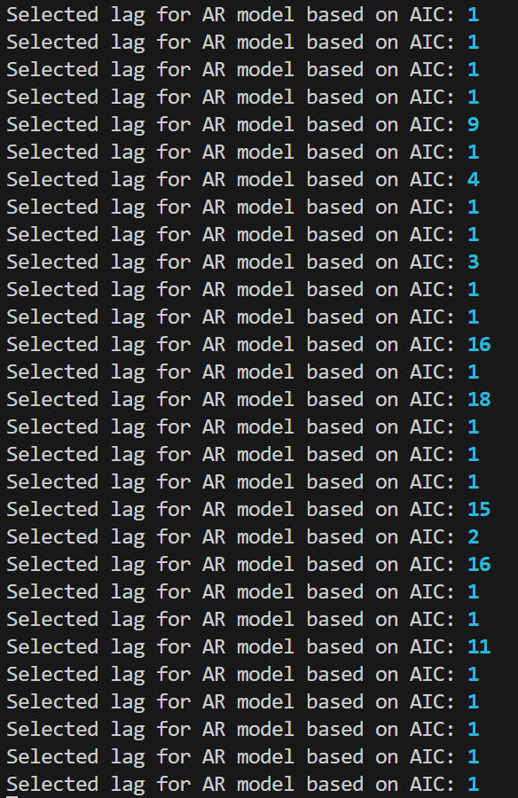

**hqic**

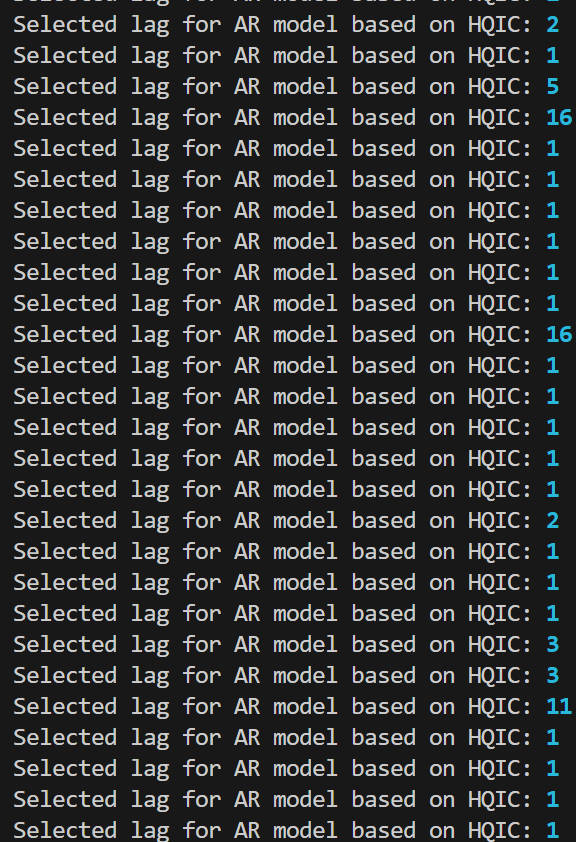

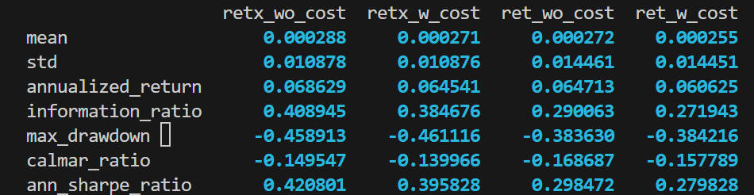

> 综合来看，选择最大 lag 的时候是很少的，但是经过选择都有了一定的提升。

### Statevariable

目前来看 VAR 的过程越长越好，所以还是选取 150 月，并且 demean 150 月。

还有一个区别是博杰师兄实证中加了 statevariable，我也加一个 smb。

> 计算残差时候还是 market 单独回归，但是在分解时候加上了 SMB。

加了 SMB 反而变差了

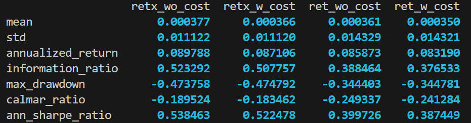

包括 VAR 阶数，以及其他全部一样的情况下，只对 mkt 分计算 coskewness 的结果

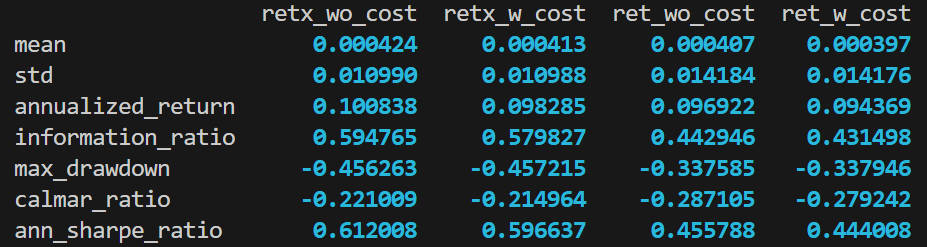

## TODO

- 增加数据量 提高交易频率 周频数据

