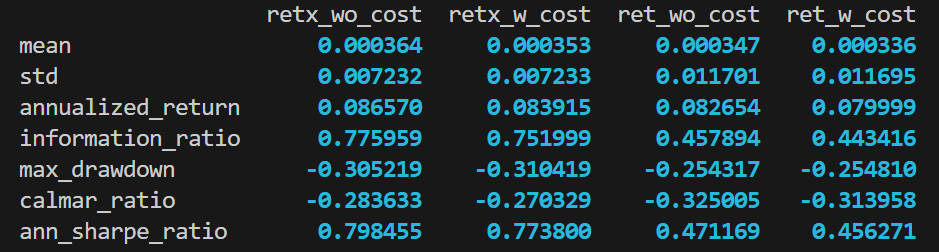
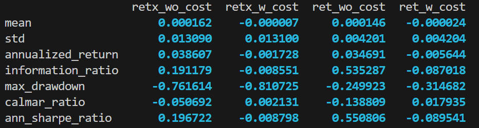
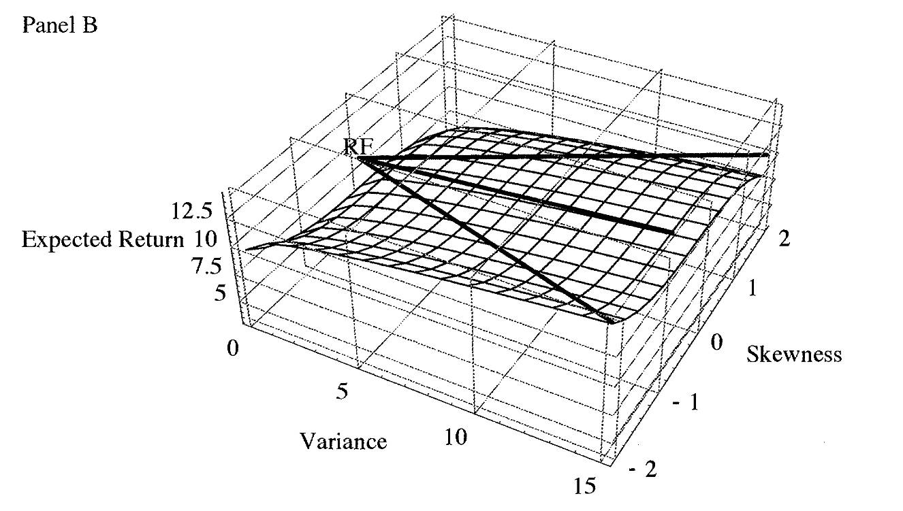
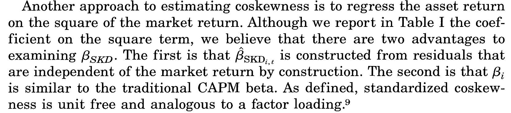
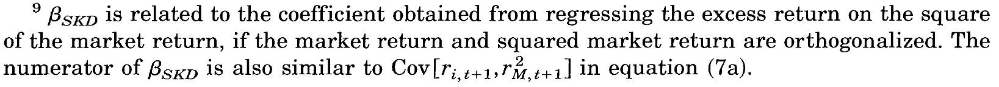

# 20240112

## Value-weighted

经查，原文中使用的是 value-weighted，所以我也把信号转为了 value-weighted，结果没什么变化

long-only

long-short

## Covariance and Coskewness

细细地看一下这个图，结合模型来看

$$
x_t = A x_{t-1} + \varepsilon_{t}
$$

相当于是用 $Ax_{t-1}$ 预测 $x_t$，abnormal 的部分就是 $\varepsilon_t$。当出现了预期外的大涨或大跌，那么就会出现取值很大的 $\varepsilon_t$。

不同频率的 $\varepsilon_t^{(j)}$ 就是通过这样的 $\varepsilon_t$ 相加相减得到的，

$$
\varepsilon_t^{(j)}=\frac{1}{\sqrt{2^j}}\left(\sum_{i=0}^{2^{j-1}-1}\varepsilon_{t-i}-\sum_{i=0}^{2^{j-1}-1}\varepsilon_{t-2^{j-1}-i}\right).
$$

这也相当于是对这些 $\varepsilon_t$ 做了平滑处理。因为低频平滑的更多，所以低频会有很强的时滞性，并且需要连续的上涨才能使得低频序列产生明显的偏移。高频则相反，这些变化能够及时的体现出来。

从图中可以看到，如果以 2015 的牛市为例，如果选择与 $8-16$ 个月频率最相关的个股，那么实际上是在牛市开始半年之后才开始上涨。

以及，如果要是选择了 covariance 最大的个股，那么在享受上涨的情况下也会承担下跌的风险。

所以这反映出了 covariance 的两个问题，**两面性**和**时滞性**。

### 两面性

coskewness 来自于 2000 年的 JF Conditional Skewness in Asset Pricing Tests。

> Everything else being equal, investors should prefer portfolios that are **right-skewed** to portfolios that are **left-skewed**.

Right (Positive) -skew means more frequent small losses and a few large gains. Similarly, left-skew means more frequent small gains and a few large losses.

Hence, assets that decrease a portfolio's skewness (i.e., that make the portfolio returns more leftskewed) are less desirable and should command higher expected return. Similarly, assets that increase a portfolio's skewness should have lower expected returns.

Empirical motivation: standard CAPM fails to explain the smallest market-capitalized deciles which is the strategy with **the most skewed returns**.

我们想要大涨，但是并不想要大跌，所以在 covariance 大的个股中又选择了 right coskewness 的个股，相当于是 double sort。

### 时滞性

高频

## Coskewness

CAPM 的假设是 sdf 可由 market 线性表示

$$
m_{t+1}=a_t+b_tR_{M,t+1},
$$

接着，将 SDF 的期望形式 $\boldsymbol{E}\left[(1+\boldsymbol{R}_{i,t+1})m_{t+1}|\boldsymbol{\Omega}_t\right]=1$ 展开得到

$$
\mathrm{Cov}_t[m_{t+1},(1+R_{i,t+1})]+E_t[1+R_{i,t+1}]E_t[m_{t+1}]=1
$$

或者也可以写为

$$
E_t[1+R_{i,t+1}]=\frac{1}{E_t[m_{t+1}]}-\frac{\mathrm{Cov}_t[m_{t+1},(1+R_{i,t+1})]}{E_t[m_{t+1}]}.
$$

假设无风险资产的存在，则有

$$
E_t[r_{i,t+1}]=\frac{\mathrm{Cov}_t[r_{i,t+1},r_{M,t+1}]}{\mathrm{Var}_t[r_{M,t+1}]}E_t[r_{M,t+1}]
$$

这就得到了 CAPM 的标准估计形式，这里 $r$ 代表超过无风险资产的收益率。

> [!TIP]
> 对于任意超额收益，有 $E_t[m_{t+1} r_{i,t+1}]=0$，将 market 带入解得
$$
\begin{aligned}
E_t\begin{bmatrix}m_{t+1}r_{i,t+1}\end{bmatrix}=&E_t\begin{bmatrix}\left(a_t+b_t\right.R_{M,t+1})r_{i,t+1}\end{bmatrix} \\ 
=&a_tE_t[r_{i,t+1}]\mathrm{~+~}b_tE_t\begin{bmatrix}R_{M,t+1}r_{i,t+1}\end{bmatrix} = 0.
\end{aligned}
$$
> 将无风险资产带入得
$$
E_t\begin{bmatrix}m_{t+1}\end{bmatrix}=\frac{1}{1+R_{f,t+1}} = a_t+b_t\operatorname{E}_t\begin{bmatrix}R_{M,t+1}\end{bmatrix}
$$
> 将期望公式带入得
$$
0=a_tE_t[r_{i,t+1}]\mathrm{~+~}b_t{\left[\mathrm{Cov}_t{\left(R_{M,t+1},r_{i,t+1}\right)}\mathrm{~+~}E_t{\left[R_{M,t+1}\right]}E_t{\left[r_{i,t+1}\right]}\right]}
$$
> 整理一下有
$$
\begin{aligned}
0&=\left(a_t+b_tE_t[R_{M,t+1}]\right)E_t[r_{i,t+1}]+b_t\mathrm{~Cov}_t(R_{M,t+1},r_{i,t+1}) \\
&=\frac{1}{1+R_{f,t+1}}E_t[r_{i,t+1}]+b_t\mathrm{Cov}_t\left(R_{M,t+1},r_{i,t+1}\right) \\
\Longrightarrow E_t[r_{i,t+1}] &= -(1+R_{f,t+1})b_t \mathrm{Cov}_t(R_{M,t+1},r_{i,t+1})
\end{aligned}
$$
> 将市场组合带入 SDF 定价公式有
$$
0=E_t\left[\left(a_t+b_t\right.R_{M,t+1}\right)r_{M,t+1}]=a_tE_t[r_{M,t+1}]\mathrm{~+~}b_tE_t{\begin{bmatrix}R_{M,t+1}r_{M,t+1}\end{bmatrix}}.
$$
> 有
$$
E_t{\left[R_{M,t+1}r_{M,t+1}\right]}=\mathrm{Cov}_t{\left(R_{M,t+1},r_{M,t+1}\right)}\mathrm{~+~}E_t{\left[R_{M,t+1}\right]}E_t{\left[r_{M,t+1}\right]},
$$
> 因为 $r_{M,t+1} = R_{M,t+1} - R_{f,t+1} $ 且 $R_{f,t+1}$ 在时刻 $t$ 是常数，故
$$
\mathrm{Cov}_t\begin{pmatrix}R_{M,t+1},&r_{M,t+1}\end{pmatrix}=\mathrm{Cov}_t\begin{pmatrix}R_{M,t+1},&R_{M,t+1}-R_{f,t+1}\end{pmatrix}=\mathrm{Var}_t\begin{pmatrix}R_{M,t+1}\end{pmatrix}.
$$
> 所以最后可以得到
$$
-\left(1+R_{f,t+1}\right)b_t=\frac{E_t[r_{M,t+1}]}{\mathrm{Var}_t{\left(r_{M,t+1}\right)}}
$$
> 带回上式则有
$$
E_t[r_{i,t+1}]=\frac{\mathrm{Cov}_t{\left(r_{i,t+1},r_{M,t+1}\right)}}{\mathrm{Var}_t{\left(r_{M,t+1}\right)}}E_t{\left[r_{M,t+1}\right]}.
$$
> 

通过泰勒展开可以得到 SDF 关于效用的表达形式，

$$
m_{t+1}=1+\frac{W_tU^{\prime\prime}(W_t)}{U^{\prime}(W_t)}R_{M,t+1}+o(W_t),
$$

其中 $W_t$ 是 wealth，$U$ 代表效用函数。

> [!TIP]
> $W_t$ is current wealth，$W_{t+1} = W_t (1 + R_{M,t+1}) $ is next period's wealth, SDF can be approximated as
$$
m_{t+1}=\frac{U^{\prime}(W_{t+1})}{U^{\prime}(W_t)}
$$
> Expand $U'(W_{t+1})$ around $W_t$
$$
U^{\prime}(W_{t+1})\approx U^{\prime}(W_t)+U^{\prime\prime}(W_t)(W_{t+1}-W_t)+\frac{1}{2}U^{\prime\prime\prime}(W_t)(W_{t+1}-W_t)^2+\ldots
$$
> express $W_{t+1} - W_t$ in terms of returns and formulate the SDF
$$
m_{t+1}=\frac{U^{\prime}(W_{t+1})}{U^{\prime}(W_t)}\approx1+\frac{W_t U^{\prime\prime}(W_t)}{U^{\prime}(W_t)}R_{M,t+1}+\frac{1}{2}\frac{W_t^2 U^{\prime\prime\prime}(W_t)}{U^{\prime}(W_t)}R_{M,t+1}^2+\ldots
$$
> then 
$$
m_{t+1}=1+\frac{W_tU^{\prime\prime}(W_t)}{U^{\prime}(W_t)}R_{M,t+1}+o(W_t)
$$
> 

$R_{M,t+1}$ 前面的系数就是 $b_t$，并且 $a_t = 1 + o(W_t), b_t <0$。$b_t$ 为负是因为随着下一期市场收益率的提高，marginal rate of substitution 会降低，这是因为**效用函数的边际递减**。

除了假设线性关系，我们还可以假设**非线性关系**，如

$$
m_{t+1}=a_t+b_tR_{M,t+1}+c_tR_{M,t+1}^2.
$$

类似地，在这种情况下可以推导出与 **covariance** 和 **coskewness** 相关的表达式

$$
E_t[r_{i,t+1}]=\lambda_{1,t}\operatorname{Cov}_t[r_{i,t+1},r_{M,t+1}]+\lambda_{2,t}\operatorname{Cov}_t[r_{i,t+1},r_{M,t+1}^2]
$$

其中

$$
\begin{aligned}\lambda_{1,t}&=\frac{\mathrm{Var}_{t}[r_{M,t+1}^{2}]E_{t}[r_{M,t+1}]-\mathrm{Skew}_{t}[r_{M,t+1}]E_{t}[r_{M,t+1}^{2}]}{\mathrm{Var}_{t}[r_{M,t+1}]\mathrm{Var}_{t}[r_{M,t+1}^{2}]-(\mathrm{Skew}_{t}[r_{M,t+1}])^{2}},\\\\\lambda_{2,t}&=\frac{\mathrm{Var}_{t}[r_{M,t+1}]E_{t}[r_{M,t+1}^{2}]-\mathrm{Skew}_{t}[r_{M,t+1}]E_{t}[r_{M,t+1}]}{\mathrm{Var}_{t}[r_{M,t+1}]\mathrm{Var}_{t}[r_{M,t+1}^{2}]-(\mathrm{Skew}_{t}[r_{M,t+1}])^{2}}.\end{aligned}
$$

同样，通过泰勒展开至二阶，可以得到

$$
m_{t+1}=1+\frac{W_tU^{\prime\prime}(W_t)}{U^{\prime}(W_t)}R_{M,t+1}+\frac{W_t^2U^{\prime\prime\prime}(W_t)}{2U^{\prime}(W_t)}R_{M,t+1}^2+o(W_t).
$$

其中 $b_t < 0, c_t >0$，之所以 $c_t > 0$ 是因为 **nonincreasing abosolute risk aversion** $U^{\prime\prime\prime} > 0$。NARA 就代表着在一个组合中 increases in total skewness are preferred。在一个组合中，如果加入与这个组合 coskewness 为负的资产就会使得整个组合的 skewness 下降，从而要求更多的回报。

**A mean-variance-skewness surface**

**Measure of the coskewness**

相比于直接将收益率回归到市场收益率的平方去得到 coskewness，文章选取了以下 measure

$$
\hat{\beta}_{\mathrm{SKD}_i}=\frac{E[\epsilon_{i,t+1}\epsilon_{M,t+1}^2]}{\sqrt{E[\epsilon_{i,t+1}^2]}E[\epsilon_{M,t+1}^2]},
$$

并且说明了二者之间的相关性

