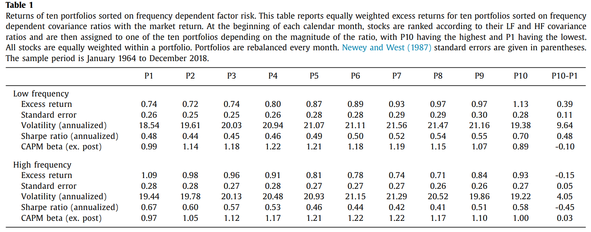
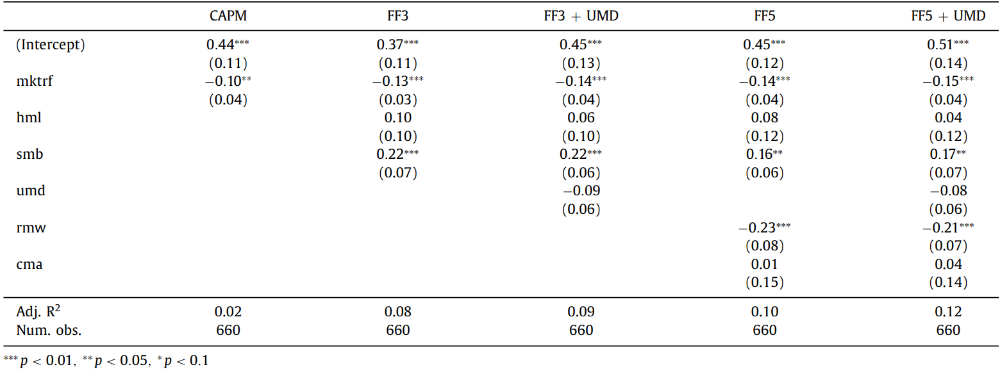
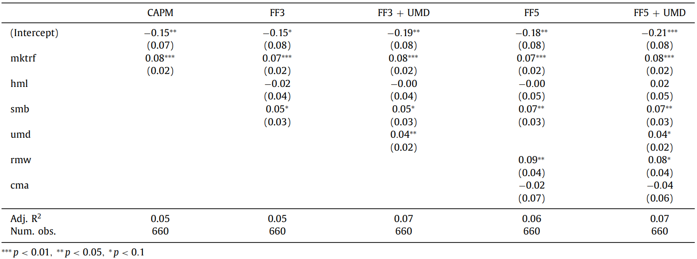
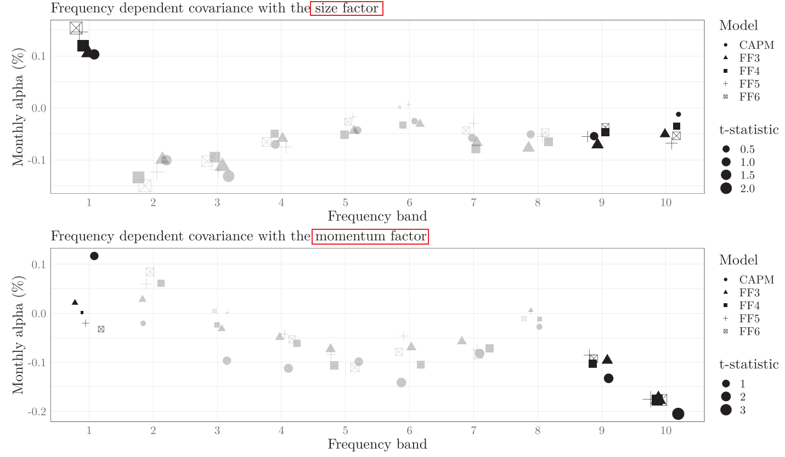
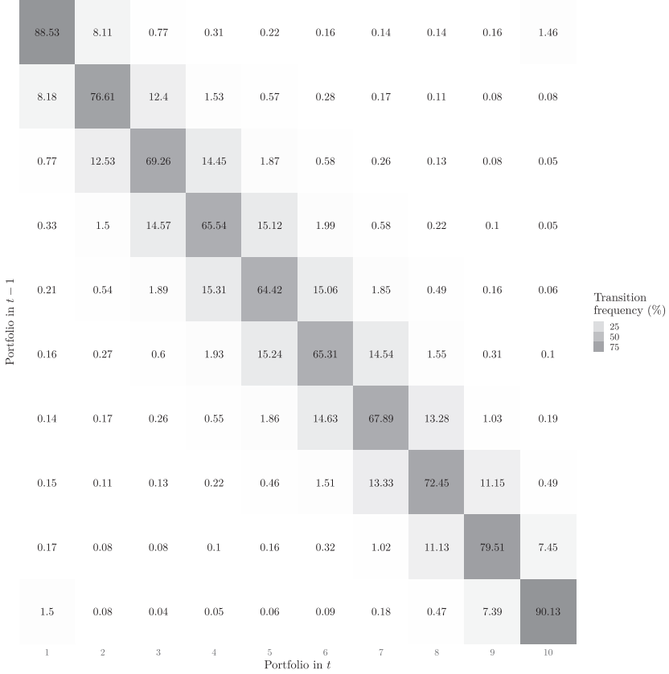

# Frequency dependent risk

Andreas Neuhierl1, Rasmus T. Varneskov2, ***Journal of Financial Economics***, 2021

1. *Washington University in St. Louis, Olin Business School, United States*
2. *Copenhagen Business School, Denmark*

基础线性定价公式为：

$$
\begin{equation}
    E[R^e_i] = \underbrace{\frac{Cov(R^e_i,f)}{Var(f)}}_{\text{Beta}} E[f]
\end{equation}
$$

此公式告诉我们，资产的定价由其 beta 决定，本文在此基础上，对该定价公式进行了频域上的探索。

具体来说，稍作变换可以得到：

$$
\begin{equation}
    E[f_t] = \underbrace{\frac{E[f]}{Var(f)} Cov(R^e_i,f) }_{\text{Beta risk}}  \times \underbrace{\sum_{j=1}^q\frac{\mathbf{Cov}_{R^e,f}(\vartheta_j,\vartheta_{j+1})}{\mathbf{Cov}(R^e_i,f)}}_{\text{frequency risk}}
\end{equation}
$$

其中：
- $\mathbf{Cov}_{R^e,f}(\vartheta_j,\vartheta_{j+1})$ 代表协方差分解后 $\vartheta_j \sim \vartheta_{j+1}$ 频率的部分。
- **Frequency risk 项等于1**。
 

也就是说，我们可以在原本的定价基础上，**研究不同频率所获得的风险补偿**，这提供了一种更加细致的在横截面上区分股票的方法。

直觉上，协方差衡量两个时间序列之间的同向运动程度，那么其高频部分代表其中高频的同向运动，低频同理。

**结论**：协方差分解后得到的频率中，低频与高频均包含额外的定价信息，其中低频更加显著。

## Methodology

已经知悉了 Idea，建立了理论基础，那么接下来就只有一个问题：**如何对协方差进行傅里叶分解**？

本文一个最大的优点就是**非参数化**，Methodology 分为三步，展示了从参数化过渡到非参数化的过程。

### Frequency domain definitions

$$
\begin{equation}
    C_{yx}(h)=\mathrm{Cov}(\mathbf{y}_t,\mathbf{x}_{t-h}),\quad f_{yx}(\lambda)=\frac1{2\pi}\sum_{h=-\infty}^\infty\mathbf{C}_{yx}(h)e^{-\mathrm{i}\lambda h}, \label{3}
\end{equation}
$$

式（3）给出了有关协方差分解的核心定义部分。其中 $\lambda$ 代表频率，$C_{yx}(h)$ 代表互协方差（cross-covariance，当 lag 为 0 则等同于协方差），$f_{yx}(\lambda)$ 代表 cospectral density。基于这两个概念，可以告诉我们在**不同频率下两个时间序列的“相关性”**。

通过 Parseval 定理，有：

$$
\begin{equation}
   C_{yx}(0)=2\pi\int_0^\infty f_{yx}(\lambda)d\lambda\simeq\frac{2\pi}{T-1}\sum_{j=1}^{T-1}\Re{\left(f_{yx}(\lambda_j)\right)}, \label{4}
\end{equation}
$$

$\Re()$ 代表实部，$\lambda_j = 2\pi j/T$。

> [!Theorem|label:Parseval theorem]
> Parseval's theorem states that the total energy (or variance) in the time domain is equal to the total energy in the frequency domain. It's a fundamental principle in signal processing that bridges the time and frequency domains, which allows us to infer time-domain relationships (like covariance) using frequency-domain data (like spectral density)

> [!TIP|label:Derivation]
$$
\begin{aligned}
    C_{yx}(h) &= 2\pi\int_0^\infty f_{yx}(\lambda) e^{\mathrm{i}\lambda h} d\lambda \\
    &=2\pi\int_0^\infty \left(\Re({f_{yx}})+\Im({f_{yx}})i\right) \left(\cos(\lambda h)+i \sin(\lambda h)\right) d\lambda\\
    &= 2\pi \left[\int_0^\infty \Re({f_{yx}})\cos(\lambda h)  - \Im({f_{yx}}) \sin(\lambda h)d\lambda\right] \\
    &+ 2\pi i \left[  \int_0^\infty \Re({f_{yx}})\sin(\lambda h)+ \Im({f_{yx}}) \cos(\lambda h) d\lambda \right] \\
    C_{yx}(0) &= 2\pi\int_0^\infty f_{yx}(\lambda) d\lambda = 2\pi\int_0^\infty \Re({f_{yx}}) d\lambda
\end{aligned}
$$
> 

这一公式的含义是：通过 Parseval theorem 以及 cospectral density，**可以衡量 covariance 这一静态指标中的动态贡献**。

### A frequency decomposition of the equity premium

由 SDF 无条件定价公式 $E[M R^e] = 0$ 可以得到如下关系：

$$
\begin{equation}
    E[R^e] = \frac{1}{E[M]} Cov(R^e,M) \label{5}
\end{equation}
$$

本文假设 SDF $S_t$ 形式如下：

$$
\begin{equation}
    \Delta\ln S_{t+1}=\mu+\underbrace{\boldsymbol{F}^{\prime}\boldsymbol{X}_t}_{\begin{array}{c}\text{State vector}\\\mathrm{dynamics}\end{array}}+\underbrace{\boldsymbol{G}_t^{\prime}\boldsymbol{W}_{t+1}}_{\begin{array}{c}\mathrm{Gaussian}\\\mathrm{shocks}\end{array}}+\underbrace{\boldsymbol{H}^{\prime}\Delta\boldsymbol{J}_{t+1}}_{\begin{array}{c}\mathrm{Jumps}\\\end{array}}, \label{6}
\end{equation}
$$

即 SDF 由三部分组成，state variable，Gaussian shocks，Non-Gaussian shocks (jumps)。

则，式 ($\ref{5}$) 可写为：

$$
\begin{equation}
    E[R^e] = Cov(R^e,\Delta\ln S)+ \text{ Jensen's inequality correction }
\end{equation}
$$

> the Jensen’s inequality correction depends on whether the economics shocks are Gaussian, if they have stochastic (co)variance, and if the economy exhibits jumps

既然已经给出了具体形式，则我们可以直接对 SDF 的方差进行分解：

为方便起见，将式 ($\ref{6}$) 重新表达为：

$$
\varrho_{t+1} = \mu + \boldsymbol{F}^{\prime}\boldsymbol{X}_t + g_{t+1} + \ell_{t+1}
$$

首先，根据式 ($\ref{3}$) 将 Spectrum 写为：

$$
\begin{equation}
f_{\varrho\varrho}(\lambda)=\frac{C_{\mathrm{gg}}(0)+C_{\ell\ell}(0)}{2\pi}+F^{\prime}f_{XX}(\lambda)F,
\end{equation}
$$

得到 Spectral density后，进一步计算 SDF 的方差(**shocks are uncorrelated to state variable**)。shocks 方差为常数，其中并不包含周期信息，而对于 state vector，可以进行方差的分解：

$$
\begin{equation}
\begin{align*}
\underbrace{C_{\varrho\varrho}(0)}_{\text{SDF variance}}\quad=\quad &\underbrace{C_{\mathrm{gg}}(0)}_{\begin{array}{c}
\small{\text{Variance contribution}} \\ \small{\text{Gaussian shocks}}
\end{array}} \quad+\quad \underbrace{C_{\ell\ell}(0) }_{\begin{array}{c}
\small{\text{Variance contribution}} \\ \small{\text{jumps}}
\end{array}} \\&+\underbrace{\boldsymbol{F}^{\prime}\left(2\pi\int_0^\infty\boldsymbol{f}_{XX}(\lambda)d\lambda\right)\boldsymbol{F}}_{\begin{array}{c}
\small{\text{Variance contribution}} \\ \small{\text{State vector}}
\end{array}} 
\end{align*}
\end{equation}
$$

此时我们发现，两类 shocks 对于 SDF variance 和 spectral 的 contribution 都是**常数**（permanent），仅由频率的部分提供变化（transitory），因此，这一分解也被称为 **permanent-transitory decomposition**。

此时，我们得到了关于 SDF 自身的分解结果，需要注意的是，这些结果仅仅来源于先前对于 SDF 形式的假设，如果我们对资产的收益率做同样的假设，那么就可以**由 SDF 自己的方差，过渡到 SDF 与资产之间的协方差**。

假设资产收益率如下：

$$
\begin{equation}
    r_{i,t+1}=\mu_i+F_i^{\prime}X_t+G_{i,t}^{\prime}W_{t+1}+H_i^{\prime}\Delta J_{t+1},
\end{equation}
$$

Variable 完全相同，与 SDF 的区别仅在于 **Loading**。如法炮制，得到二者协方差的分解结果：

$$
\begin{equation}
\begin{align*}
\underbrace{C_{i\varrho}(0)}_{\text{Covariance}}\quad=\quad &\underbrace{C_{\mathrm{g_{i}g}}(0)}_{\begin{array}{c}
\small{\text{Covariance contribution}} \\ \small{\text{Gaussian shocks}}
\end{array}} \quad+\quad \underbrace{C_{\ell_{i}\ell}(0) }_{\begin{array}{c}
\small{\text{Covariance contribution}} \\ \small{\text{jumps}}
\end{array}} \\&+\underbrace{\boldsymbol{F}_{i}^{\prime}\left(2\pi\int_0^\infty\boldsymbol{f}_{XX}(\lambda)d\lambda\right)\boldsymbol{F}}_{\begin{array}{c}
\small{\text{Covariance contribution}} \\ \small{\text{State vector}}
\end{array}} 
\end{align*}
\end{equation}
$$

$$
\begin{equation}
f_{i\varrho}(\lambda)=\frac{C_{\mathrm{g_{i}g}}(0)+C_{\ell_{i}\ell}(0)}{2\pi}+F_{i}^{\prime}f_{XX}(\lambda)F,
\end{equation}
$$

与 SDF 自身分解相同，我们也可以将 SDF 与资产之间的 cospectrum 与 variance 分解为三部分贡献：

- permanent Gaussian shocks
- permanent non-Gaussian shocks
- state vector

只有来自于 state vector 的部分在不同频率上贡献不同，并且这种贡献中，**包含了有关 state variable 的信息**。

### Recovering state vector information from the cross-section

尽管该分解能够提供很多信息，但是最大的问题是**我们往往并不能观测到 state variable $X_t$ 的具体形式，因而不能得出 SDF 的具体数值**，就无法进行如上计算，除非对 state variable 与 SDF 进行参数化的假设，例如 CCAPM 与 long-run risk model 等。

然而，通过上文我们知道，只要符合结构，就可以进行傅里叶分解，**既然资产收益率能够与 SDF 进行协方差的分解，那么资产与资产之间当然也可以计算协方差**。

***这就提供了一条让我们绕开对 state variable 的假定，从而直接从资产的截面数据中获得信息的途径。***

由此，我们从参数化的部分，过渡到了**非参数化的**部分。

对于 asset i 和 b，有以下分解：

$$
\begin{equation}
    C_{ib}(0)=C_{g_ig_b}(0)+C_{\ell_i\ell_b}(0)+F_i^{\prime}\Big(2\pi\int_0^\infty f_{XX}(\lambda)d\lambda\Big)F_b \label{13}
\end{equation}
$$

例如，我们用 market return M 代替 b，则 i 与 b 都是可观测数据，**那么就无需假定参数形式而直接得到有关 $X$ 的信息，包括其 risk price $F$ 的信息**。

并且，如果可以通过其他因子（如 SMB, HML）来替换 b ，那么就可以得到更多有关 $X$ 的信息。

### The frequency term structure of risk

基于式 ($\ref{3}$) 与式 ($\ref{13}$)，我们可以进一步分离出不同频率上的信息。

$$
\begin{equation}
\begin{align*}
    \mathbf{C}_{ib}(\vartheta_1,\vartheta_2)&\equiv\frac{2\pi}T\sum_{j=\vartheta_1}^{\vartheta_2}\Re(\boldsymbol{f}_{ib}(\lambda_j)) \\
    &=\left(\mathbf{C}_{\mathfrak{g}_i\mathfrak{g}_b}(0)+\mathbf{C}_{\ell_i\ell_b}(0)\right)\left(\frac{\vartheta_2-\vartheta_1}T\right)\\&+\boldsymbol{F}_i^{\prime}\left(\frac{2\pi}T\sum_{j=\vartheta_1}^{\vartheta_2}\Re(\boldsymbol{f}_{XX}(\lambda_j))\right)\boldsymbol{F}_b,
\end{align*} \label{14}
\end{equation}
$$

与频率无关的部分，我们认为其在所有频率上**均匀分布**，而与频率有关的部分，则按照**对应频率累加**。

如果我们进一步假定 $\boldsymbol{F}_i$ 与 $\boldsymbol{F}_b$ 符号相同，并且有 $\vartheta_1<\vartheta_2<\vartheta_3<\vartheta_4,\ \vartheta_2-\vartheta_1=\vartheta_4-\vartheta_3$，则可以做出以下非参数假定：

$$
\begin{equation}
    \begin{cases}\mathbf{C}_{iM}(\vartheta_1,\vartheta_2)>\mathbf{C}_{iM}(\vartheta_3,\vartheta_4)\\\quad\text{LF component more important than HF}\\\mathbf{C}_{iM}(\vartheta_1,\vartheta_2)=\mathbf{C}_{iM}(\vartheta_3,\vartheta_4)\\\quad\text{LF component equally important to HF}\\\mathbf{C}_{iM}(\vartheta_1,\vartheta_2)<\mathbf{C}_{iM}(\vartheta_3,\vartheta_4)\\\quad\text{LF component less important than HF}&\end{cases}
\end{equation}
$$

如果对于资产 $i$ 和 $j$，我们得到了如下公式，即 LF 比 HF 更重要，那么我们就可以得到有关其 risk price 的信息：

$$
\begin{equation}
    \begin{aligned}\mathbf{C}_{iM}(\vartheta_1,\vartheta_2)-\mathbf{C}_{iM}(\vartheta_3,\vartheta_4)>&\mathbf{C}_{jM}(\vartheta_1,\vartheta_2) -\mathbf{C}_{jM}(\vartheta_3,\vartheta_4)\\\quad\Longrightarrow\quad\mathbf{F}_i>&\mathbf{F}_j,\end{aligned}
\end{equation}
$$

这代表说，资产 $i$ 和 $j$ 有相同的 state variable，但是资产 $i$ 有更高的 risk price。**这就直接将频率分解的结果与横截面定价链接了起来**。

## Empirical application

Methodology 部分从 SDF 无条件定价公式开始，告诉我们 SDF 自身，以及 SDF 与资产之间的协方差可以进行分解，但是这种分解有一个问题，就是 SDF 的序列数据并不好得到。因此，在给定收益率结构假设后，该方法论可以迁移到资产与资产之间。

> 所以其实到这一步之后，就已经与 SDF 没有关系了

然而，**迁移到资产之间后，从理论上，就只有计算的方式，而没有了方法论的支撑**。

因此，我们从资产与资产之间的关系，**CAPM**，出发，得到理论上的直觉：

$$
\begin{equation}
\begin{align*}
    E[R^e] &\simeq \gamma\times\mathbf{C}_{iM}(1,T) \\
    &= \gamma\times\underbrace{\mathbf{C_M}(1,T)\boldsymbol{\beta_{i,M}}}_{\text{beta risk}} \times \underbrace { \sum _ { j = 1 }^q\frac{\mathbf{C_{iM}}(\vartheta_j,\vartheta_{j+1})}{\mathbf{C_{iM}}(1,T)}}_{\text{frequency risk}},
\end{align*}
\end{equation}
$$

这也就是开头说的，在原本的定价基础上，**研究不同频率所获得的风险补偿**。通过 $\frac{\mathbf{C_{iM}}(\vartheta_j,\vartheta_{j+1})}{\mathbf{C_{iM}}(1,T)}$ 这一 **cov ratio**，我们就可知悉，是否某些频率对应着更高的风险溢价。

> [!NOTE|label:Standard CAPM]
> 式 $E[R^e] \simeq \gamma\times\mathbf{C}_{iM}(1,T)$ 为什么被称之为是 Standard CAPM 呢？
>
> 这个式子的来源是 CCAPM，$E[R^e] \approx\gamma(c_0)\operatorname{Cov}[g,R_i]$，其中 $c_0$ 代表当期消费，$g$ 代表消费增长率。此时，如果存在一个特殊的组合收益率为 $R^c = a+bg$，与消费增长完全相关，则有
$$
\begin{align*}
    \operatorname{E}[R^c]-R^f&\approx\gamma(c_0)\operatorname{Cov}[g,R^c]=\gamma(c_0)b\operatorname{Var}[g] \\
    \gamma(c_0)&\approx\frac1{b\operatorname{Var}[g]}\left(\operatorname{E}[R^c]-R^f\right)
\end{align*}
$$
> 带入有
$$
\begin{aligned}
\operatorname{E}[R_{i}]-R^{f}& \approx\frac1{b\operatorname{Var}[g]}\left(\operatorname{E}[R^c]-R^f\right)\operatorname{Cov}[g,R_i]  \\
&=\frac1b\beta[R_i,g]\left(\operatorname{E}[R^c]-R^f\right)=\beta[R_i,R^c]\left(\operatorname{E}[R^c]-R^f\right).
\end{aligned}
$$
> 也就是标准的 CAPM 形式，只不过常见的市场组合收益率 $R^M$ 被替换成了 $R^c$。
>
> 之所以从 CAPM 而不从 FF3 出发，是因为该 ***协方差分解只能两两进行*** ，而 CAPM，按照其理论的推导形式，如果存在理想中的消费组合，那么是可以满足定价要求的。因此 market factor 作为消费组合最具代表性的 proxy，当然要从这里入手，不过在随后，也会测试其余因子。
>
> 实际上，我们并不需要选择的因子或模型是**正确的**，只需要该因子与真正的 **state variable** 相关，也就是 $\boldsymbol{F}$ 不全为零。

在实际操作中，我们并不沿用式 ($\ref{14}$) 的计算方式，而是采用：

$$
\begin{equation}
    \mathbf{C}_{iM}(\vartheta_1,\vartheta_2)\simeq\frac{2\pi}{T}\sum_{j=\vartheta_1}^{\vartheta_2}\Re(\mathbf{I}_{iM}(\lambda_j)),
\end{equation}
$$

这是因为我们想对于每一只股票计算 cov ratio，而在计算 cov ratio 的过程中，作为常数的 shock variance 和 loading 均不起作用，因此我们只需计算频率分解的结果即可。

其中，

$$
I_{iM}(\lambda_j)=\boldsymbol{w}_i(\lambda_j)\bar{\boldsymbol{w}}_M(\lambda_j), \qquad \mathbf{w}_i(\lambda_j)=\frac1{\sqrt{2\pi T}}\sum_{t=1}^T\tilde{r}_{i,t}e^{\mathrm{i}t\lambda},
$$

bar 代表 complex conjugate, $\tilde{r}_{i,t}=\sum_{k=0}^2\text{ln}(1+r_{i,t+k})$ to eliminate concerns due to nonsynchronous trading.

> [!TIP|label:实证设计]
> 在每个月初，使用过去五年的**月频**收益率数据，要求最少 2.5 年的非缺失数据（375 observations），将频率**十等分**，并计算 cov ratio，按照每个 bins 的 cov ratio 排序，采用等权构造投资组合。

### Sorting <!-- {docsify-ignore} -->

计算 stock 与 market factor 的 cov ratio 并进行排序，可以看到显著的单调性。

#### The symmetry between LF and HF <!-- {docsify-ignore} -->

因为计算指标是一个 cov ratio，所以低频低就一定意味着高频高，反之亦然。举例来说，我们可以将频率区间分为两半，分别计算 cov ratio 并构建 long-short投资组合，此时 LF 与 HF portfolio 一定会有着完全相反的收益率。

然而，当分组数目增多后，情况发生了变化。例如，分组数量为3，如果仅**存在一个 state variable**，那么不同频率 ratio 的大小也就由其 Loading 决定，如果随着低频成分不断增加 Loading 也会不断增加，那么反之，高频成分的不断增加也对应了 Loading 的不断减少，那么结果仍然会是完美相关。

然而，实证数据表明了二者的相关性仅为 **-0.49**，也就是说，**此时 state variable 的数量绝对不止一个**。导致了如下情况的出现

$$
\begin{aligned}
    & \text{Ratio value from low-to-high freq} \\
    & \text{Stock A}: [0.1,0.3,0.6] \\
    & \text{Stock B}: [0.05,0,55,0.4] \\
\end{aligned}
$$

### Alpha <!-- {docsify-ignore} -->

**Low Frequency**

最低频部分构造出的投资组合并不能被传统因子模型所解释：

**High Frequency**

高频部分同样无法被解释，不过显著性和数值大小都小了很多：

### Other factors <!-- {docsify-ignore} -->

与 size or momentum 计算 cov ratio 之后的 alpha 情况

### Transaction cost  <!-- {docsify-ignore} -->

组合内股票比较稳定，因此transaction cost也比较低。

## Conclusion

总结起来就是，只要符合式 $\ref{10}$ 的结构，就可以计算协方差并进行分解。文章还给出了 4 个 asset pricing model 的例子，并说明这四个模型的 SDF 都可以写成此类结构，因而均可以进行分解，这样的话就提供了经济学理论的联系。

而在分解的过程中，核心部分是 Parseval's theorem。让我们再回顾一下 Parseval theorem：信号在时域内的能量等于其在频域内的能量。这一 theorem 将频域与时域连接起来，可用以研究不同频率上的能量分布。

那么下一步的研究自然针对于 [Parseval's theorem](/finance_saliency/Parseval.md)

