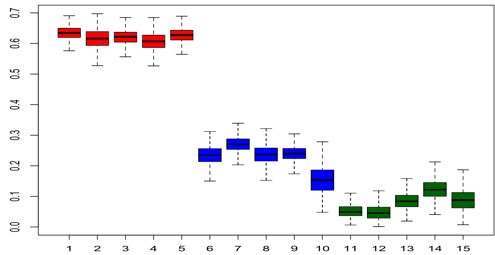

# Bayesian spectral modeling for multiple time series

Cadonna A, Kottas A, Prado R. ***Journal of the American Statistical Association***, 2019.

## Periodogram

对于一个时间序列 $x(t)$，我们可以对其进行傅里叶变换得到频率成分，$T$ 代表其周期，

$$
\begin{equation}
    X_T(f)=\int_{-\frac T2}^{\frac T2}x(t)e^{-i2\pi ft}\mathrm{~d}t
\end{equation}
$$

此时的频率成分，仅仅是一个虚数，并没有能量的概念，在频域中的能量概念，我们用 Power Spectral Density (PSD) 表示，准确来说，是单位时间内的能量，也就是功率：

$$
\begin{equation}
    \begin{aligned}
        S_x(f) &=\int_{-\infty}^\infty R_x(\tau)e^{-i2\pi f\tau}\mathrm{~d}\tau \\
        R_x(\tau) &=\int_{-\infty}^\infty S_x(f)e^{i2\pi f\tau}\mathrm{~d}f 
    \end{aligned}
\end{equation}
$$

其中，$R_x(\tau)$ 是 $x(t)$ 的自相关函数，$\tau$ 代表滞后阶数。

通过这种方法推导出的 PSD 是一个真实值的概念，我们需要用样本值进行估计，根据推导过程，其估计量就是周期图 (Periodogram)

$$
\begin{equation}
    I_x(f) = \frac{1}{T} X_T(f) X^*_T(f)
\end{equation}
$$

当 $T \rightarrow \infty$，并取期望时，就得到了 PSD。

[Derivation](https://leetah666.github.io/Notes/#/frequency/energy_power_and_spectral_density)

同理，当我们想衡量两个时间序列间的能量时，我们可以通过互相关函数（Cross-Correlation function）定义出互功率谱密度（Cross Power Spectral Density，CPSD），

$$
\begin{equation}
    \begin{aligned}
        S_{xy}(f)&=\int_{-\infty}^\infty R_{xy}(\tau)e^{-i2\pi f\tau}\mathrm{~d}\tau\\R_{xy}(\tau)&=\int_{-\infty}^\infty S_{xy}(f)e^{i2\pi f\tau}\mathrm{~d}f
    \end{aligned}
\end{equation}
$$

此时 CPSD 的估计量就是互周期图（Cross Periodogram）

$$
\begin{equation}
    I_{xy}(f) = \frac{1}{N} X(f) Y^*(f)
\end{equation}
$$

既然是估计量，就有优化的空间，这篇文章就是在 **周期图** 的基础上提出了贝叶斯优化来提高估计。

而根据 CPSD 的定义，当 $\tau$ 取零时，有

$$
\begin{equation}
    R_{xy}(0) = \int_{-\infty}^\infty S_{xy}(f)\mathrm{~d}f 
\end{equation}
$$

这也就是协方差的概念，此式也正是 FDR 中应用的式子，而后续在实证计算中，作者直接使用了互周期图来计算 CPSD，所以理论上来说，互周期图作为一个估计量，也有提升的空间。

## 从 Whittle Likelihood 谈起

周期图作为一个估计量，有许多很好的性质，这是频域估计中的出发点。

根据周期图定义，有

$$
I_n(f_j)=\frac1N X_jX_j^*  =\frac1N(\mathrm{Re}({X}_j)^2+\mathrm{Im}(X_j)^2)
$$

当 $x(t)$ 是零均值平稳高斯时间序列，$X_j$ 的实部和虚部也是零均值高斯分布，

$$
\begin{aligned}\operatorname{Re}(X_j)\sim\mathcal{N}(0,\sigma^2) \quad \operatorname{Im}(X_j)\sim\mathcal{N}(0,\sigma^2)\end{aligned}
$$

并且和功率谱密度之间的关系为

$$
\mathrm{Var}(\mathrm{Re}(X_j))=\mathrm{Var}(\mathrm{Im}(X_j))=\frac{S(f_j)}2
$$

也就是说，$X_j$ 的总方差为 $S(f_j)$，并且有 $\sigma^2 = S(f_j)/2$。
 
由于其实部和虚部是独立的零均值高斯分布，那么他们的平方和服从 $\chi^2$ 分布，自由度为 2，因此 $X_j^2$ 的概率密度函数为

$$
f_{\chi^2}(x;2\sigma^2)=\frac1{2\sigma^2}e^{-x/(2\sigma^2)},\quad x\geq0
$$ 

这实际上就是参数为 $\frac{1}{2\sigma^2}$ 的指数分布，所以 $I(f_j)$ 服从

$$
I(f_j)\sim  \text{Exponential}(\frac{1}{S(f_j)}) =  \text{Exponential}\left(\frac1{2\sigma^2}\right)
$$

> 根据指数分布的性质有 $E[I(f_j)] = S(f_j) $

对于一个时间序列 $\boldsymbol{X}_t$ 来说，当我们假设其服从多元正态分布 $\mathcal{N}(0,\Sigma)$ ，那么其概率密度函数为

$$
\begin{equation}
    f(\mathbf{X})=\frac1{(2\pi)^{T/2}|\Sigma|^{1/2}}\exp\left(-\frac12\mathbf{X}^{\prime}\Sigma^{-1}\mathbf{X}\right)
\end{equation}
$$

此时的问题在于，$\Sigma^{-1}$ 和 $|\Sigma|$ 的计算复杂度为 $O(N^3)$，当 $N$ 过大时不可行而如果通过傅里叶变换转换到频域上，那么当 $N \rightarrow \infty$，不同频率的 $X_j$ **近似独立**，因此总似然函数可以表示为各频率上似然函数的乘积

$$
\begin{equation}
    L\approx\prod_{k=1}^Np\left(X(f_j);\theta\right)
\end{equation}
$$

因为周期图服从指数分布，所以其概率密度函数为

$$
\begin{equation}
    p\left(I(f_j);\theta\right)=\frac1{S(f_j)}\exp\left(-\frac{I(f_j)}{S(f_j)}\right)
\end{equation}
$$

将所有频率的似然函数相乘，得到 Whittle 似然函数

$$
\begin{equation}
    L_{\mathrm{Whittle}}=\prod_{j=1}^{N}\left[\frac1{S(f_j)}\exp\left(-\frac{I(f_j)}{S(f_j)}\right)\right]
\end{equation}
$$

为了方便计算，取对数有

$$
\begin{equation}
    \ln L_{\mathrm{Whittle}}=\boldsymbol{-}\sum_{j=1}^{N}\left[\ln S(f_{j})+\frac{I(f_{j})}{S(f_{j})}\right]
\end{equation}
$$

此时 Whittle Likelihood 可以降低复杂度至 $O(T\log T)$。

就像传统的似然函数方法，给定数据的情况下，我们会首先计算样本中的周期图 $I(f_j)$，接着计算理论谱密度，$S(f_j,\theta)$，接着通过 Whittle Likelihood 来调整 $\theta$，使得在 $S(f_j)$ 下观测到 $I(f_j)$ 的概率最大。

## Mixture Model Approximation to the Whittle Log-Likelihood

> 文章后续的推导用 $\omega_j$ 代替 $f_j$，用 $f(\omega_j)$ 代替 $S(f_j)$

当数据不满足假设的情况下，周期图之间的值会存在相关性，并且其分布在有限样本下并不完全服从指数分布，所以，为了更好的处理周期图的统计特性，可以考虑对数周期图，$\log(I(\omega_j))$。

定义对数周期图：

$$
\begin{equation}
    Y_j = \log (I(\omega_j))
\end{equation}
$$

为了调整对数周期图的期望，引入 Euler–Mascheroni constant $\gamma$

$$
\begin{equation}
y_j = Y_j + \gamma = \log (I(\omega_j)) + \gamma
\end{equation}
$$

> [!NOTE|label: Euler–Mascheroni constant]
> Euler–Mascheroni constant 定义为
$$
\gamma=\lim_{n\to\infty}\left(\sum_{k=1}^n\frac1k-\log n\right)\approx0.5772.
$$
> 

因此，总共的调整过程分为两步，首先是 **取对数**，其次是 **引入EM常数**，那么概率密度函数就会变为

$$
\begin{equation}
\begin{aligned}
f_Y(y)&=\exp\{y-\gamma-\log(f(\omega))-\exp(y-\gamma-\log(f(\omega)))\},\\ y&\in\mathbb{R}.
\end{aligned}
\end{equation}
$$

根据这个分布，有 $\mathbb{E}[y_j]=\log(f(\omega_j)),\mathrm{var}[y_j]=\pi^2/6.$

> [!TIP|label:Derivation]
> 对于 $X \sim \text{Exp}(\lambda)$，其概率密度函数为
$$
f_X(x)=\frac1\lambda e^{-x/\lambda},\quad x>0.
$$
> 对 $X$ 取对数就会得到 $Y = \log(X)$，则其概率密度函数为
$$
f_Y(y)=\frac1\lambda e^ye^{-e^y/\lambda}=e^{y-\log(\lambda)-e^y/\lambda}.
$$
> 接着将 $Y$ 调整为 $y = Y + \gamma$，得到
$$
f_Y(y)=\exp\left\{y-\gamma-\log(\lambda)-\exp\left(y-\gamma-\log(\lambda)\right)\right\}.
$$
> 在我们的模型中 $\lambda = f(\omega_j)$，代入即得。

> [!TIP|label:Derivation2]
> 对这个分布进行重参数化，令 $z=y-\gamma-\log(f(\omega))$，那么 $y$ 可以表示为
$$
y=z+\gamma+\log(f(\omega))
$$
> 接着把 $z$ 带入原分布，有
$$
f_Z(z)=\exp\left(z-\exp(z)\right)
$$
> 这是一个标准的 Gumbel 分布 $\text{Gumbel(0,1)}$，其均值和方差为
$$
\mathbb{E}[Z] = - \gamma, \quad \text{Var}(Z) = \frac{\pi^2}{6}
$$
> 所以 $y$ 的均值为
$$
\begin{aligned}
\mathbb{E}[Y] &=\mathbb{E}[Z+\gamma+\log(f(\omega))]  \\
& =\mathbb{E}[Z]+\gamma+\log(f(\omega))  \\
& =-\gamma+\gamma+\log(f(\omega))  \\
& =\log(f(\omega)) 
\end{aligned}
$$
> 方差为
$$
\begin{aligned}
    \text{Var}(Y) = \text{Var}(Z)= \frac{\pi^2}{6} 
\end{aligned}
$$
> 

此时的问题在于，原本的指数分布中，谱密度 $f(\omega_j)$ 作为 scale parameter 同时影响分布的均值和方差，但是在这种分布下，$f(\omega_j)$ 仅能影响均值，而不再影响方差了，在统计上是一种缺陷，但是由于 Whittle 似然函数的优越性，大家还是会采用这种方法。

作者则提出了一个新的分布，用 $k$ 个高斯分布拟合这一模型，

$$
\begin{equation}
\begin{aligned}y_{j}\mid\boldsymbol{\theta}&\overset{{\mathrm{ind.}}}{\operatorname*{\operatorname*{\operatorname*{\sim}}}}\sum_{k=1}^{K}g_{k}(\omega_{j};\boldsymbol{\xi})\operatorname{N}(y_{j}\mid\alpha_{k}+\beta_{k}\omega_{j}/\pi,\sigma^{2}),\\j&=1,\ldots,N,\end{aligned}
\end{equation}
$$

- $g_k(\omega_j;\boldsymbol{\xi})$ 是第 $k$ 个高斯分布的权重

> The weight parameters vary depending on the specific form of the weights and will be fully specified in each case.

- $\boldsymbol{\xi}$ 是权重参数向量 and will be fully specified in each case
- 向量 $\boldsymbol{\theta}$ 包括了所有模型参数

> 将 $\omega$ 除 $\pi$ 是为了标准化频率到 $(0,1)$ 的范围内（common practice），在 weight function $\boldsymbol{\xi}$ 中也做了该处理。

此时的分布仍然满足 Whittle Approximation $E[y_j] = \log(f(\omega_j))$,

$$
\begin{equation}
    \log(f(\omega_j))=\sum_{k=1}^Kg_k(\omega_j;\xi)\left\{\alpha_k+\beta_k\omega/\pi\right\},\quad\omega\in(0,1),
\end{equation}
$$

但是此时 $f(\omega_j)$ 就能够 **同时影响分布背后的均值和方差了**。

其中，权重是关于频率的函数，consecutive difference，通过连续差分能保证权重和为1。

$$
\begin{equation}
    g_k(\omega;\boldsymbol{\xi})\equiv g_k(\mu(\omega),\tau)=\int_{(k-1)/K}^{k/K}f_Y(y\mid\mu(\omega),\tau)\mathrm{~d}y,
\end{equation}
$$

其中，$f_Y(y\mid\mu(\omega),\tau)$ 是定义在 $(0,1)$ logit-normal 的概率密度函数，这个正态分布均值为 $\mu(\omega)$，precision parameter 为 $\tau$。因此对于每一个频率来说，权重的分布都不同。

$\mu(\omega)$ 被定义为频率的单调函数

$$
\begin{equation}
    \mu(\omega)=\zeta+\phi\omega/\pi 
\end{equation}
$$

文章在原有模型的基础上进行了增广，加入了一个 auxiliary variables，对于每一个频率密度 $y_j$ ，都有 auxiliary variable $r_j$，因此这个增广模型可写为

$$
\begin{equation}
    \begin{aligned}y_{j}\mid r_{j},\boldsymbol{\alpha},\boldsymbol{\beta},\sigma^{2}&\overset{{\mathrm{ind.}}}{\operatorname*{\operatorname*{\operatorname*{\sim}}}}\sum_{k=1}^{K}\mathcal{N}(y_{j}\mid\alpha_{k}+\beta_{k}\omega_{j}/\pi,\sigma^{2})\\&\times\mathbb{I}\left\{(k-1)/K<\frac{\exp(r_{j})}{1+\exp(r_{j})}\leq k/K\right\}\\r_{j}\mid\boldsymbol{\xi}&\overset{{\mathrm{ind.}}}{\operatorname*{\operatorname*{\operatorname*{\sim}}}}\mathcal{N}(r_{j}\mid\boldsymbol{\zeta}+\phi\omega_{j}/\pi,1/\tau),\end{aligned}
\end{equation}
$$

Auxiliary variable 通过 Indicator function 决定了最终频谱密度分布的形状。

辅助变量的引入使得原本的混合模型变为了更容易处理和估计的条件模型，即对于每一个频率 $\omega_j$，$y_j$ 在条件上只来自于一个高斯分布，这也就是稀疏性。

> [!NOTE|label:Auxiliary variable]
> 对于一个正态分布 $R \sim (\mu, \sigma^2)$，通过 logit 逆变换可以将其映射到 $[0,1]$ 的区间上，从而构造出一个新的随机变量 $Y$
$$
y = \frac{e^r}{1+e^r}
$$
> 则 $f_Y(y\mid\mu(\omega),\tau)$ 是定义在 $(0,1)$ logit-normal 分布，因此 Indicator function 中的不等式 bound 就是 $y_j$ 的积分上下限。

### Hierarchical Model for Multiple Spectral Densities

对于 $M$ 个时间序列，假设基础分布 $(\alpha_k,\beta_k)$ 是一样的，只是权重 $\xi_m=(\zeta_m,\phi_m,\tau_m)$ 不同。

$$
\begin{equation}
\begin{aligned}y_{mj}\mid r_{mj},\boldsymbol{\alpha},\boldsymbol{\beta},\sigma^{2} \ &\overset{{\mathrm{ind}}}{\operatorname*{\operatorname*{\operatorname*{\sim}}}}\sum_{k=1}^{K}\mathbb{N}(y_{mj}\mid\alpha_{k}+\beta_{k}\omega_{j}/\pi,\sigma^{2})\\&\times\mathbb{I}\left\{(k-1)/K<\frac{\exp(r_{mj})}{1+\exp(r_{mj})}\leq k/K\right\}\\r_{mj}\mid\boldsymbol{\xi}_{m}&\overset{{\mathrm{ind.}}}{\operatorname*{\operatorname*{\operatorname*{\sim}}}}\mathbb{N}(r_{mj}\mid\zeta_{m}+\phi_{m}\omega_{j}/\pi,1/\tau_{m}).\end{aligned}
\end{equation}
$$

## MCMC details

接下来只需要知道先验就可以进行 Gibbs 采样估计了。

$\alpha,\beta$ 的先验为

$$
\begin{equation}
    \alpha_k \sim \mathrm{N}(\mu_{0\alpha},\sigma_\alpha^2), \quad \beta \sim \mathrm{N}(\mu_{0\beta},\sigma_{\beta}^2),
\end{equation}
$$

$\sigma^2$ 的先验为

$$
\begin{equation}
    \sigma^2~\sim~\text{inv-gamma}(n_{\sigma^2},d_{\sigma^2})
\end{equation}
$$

对于每个时间序列权重部分采用 hierarchical prior

$$
\begin{equation}
    \begin{aligned}(\zeta_{m},\phi_{m})\mid\boldsymbol{\mu}_{w},\Sigma_{w}&\overset{{\mathrm{ind.}}}{\operatorname*{\operatorname*{\operatorname*{\sim}}}}\mathcal{N}(\boldsymbol{\mu}_{w},\Sigma_{w}),\quad m=1,\ldots,M,\\\tau_{m}\mid d_{\tau}&\overset{{\mathrm{ind.}}}{\operatorname*{\operatorname*{\operatorname*{\sim}}}}\mathrm{gamma}(n_{\tau},d_{\tau}),\quad m=1,\ldots,M,\end{aligned}
\end{equation}
$$

其中 $\boldsymbol{\mu}_w$ 是 bivariate normal distribution，$\Sigma_w$ 是 inverse Wishart prior。对于 $\tau_m$，固定 $n_{\tau}$，$d_{\tau}$ 为 gamma 分布。 $\zeta_{m},\phi_{m}$ 是和聚类有关的参数。

具体的估计流程为，共有 $M$ 个时间序列，每个时间序列有 $K$ 个 Gaussian distribution，需要估计的分布经过标准化为，标准化使得估计出的概率密度函数和为1。

$$
\begin{equation}
w_k=\frac{g_k(\mu_m(\omega_j),\tau_m)\mathcal{N}(y_{mj}\mid\alpha_k+\beta_k\omega_j,\sigma^2)}{\sum_{i=1}^Kg_i(\mu_m(\omega_j),\tau_m)\mathcal{N}(y_{mj}\mid\alpha_i+\beta_i\omega_j,\sigma^2)},
\end{equation}
$$

接下来更新参数 $\alpha,\beta$， 同时对 $\alpha_k,\beta_k$ 进行采样，$\mu = (\mu_{\alpha},\mu_{\beta})$，$\Sigma_0$ 是对角矩阵，对角线元素为 $\sigma^2_{\alpha},\sigma^2_{\beta}$，全条件分布如下

$$
\begin{equation}
\begin{aligned}
\Sigma^*&=\sigma^2\left(\sum_{m,j:\frac{k-1}K<\frac{\exp(r_{mj})}{1+\exp(r_{mj})}\leq\frac kK}z_jz_j^{\prime}+\Sigma_0^{-1}\right)^{-1} \\
\mu^{*}&=\Sigma^{*}\biggl(\Sigma_{0}^{-1}\mu_{0}~+~\sum_{{m,j:\frac{k-1}{K}<\frac{\exp(r_{mj})}{1+\exp(r_{mj})}\leq\frac{k}{K}}}y_{mj}z_{j}\biggr)
\end{aligned}
\end{equation}
$$

其中 $z_j = (1,\omega_j)'$。

> 这里是对每一个 $k$ 分别更新。

接下来采样 $\zeta_m,\phi_m$，全条件分布为

$$
\begin{equation}
\begin{aligned}\Sigma_w^*&=\left(\sigma^{-2}\sum_{j=1}^Nq_jq_j^{\prime}+\Sigma_w^{-1}\right)^{-1}\\\mu_w^*&=\Sigma_w^*\left(\sigma^{-2}\sum_{j=1}^Nr_{mj}q_j+\Sigma_w^{-1}\mu_w\right)\end{aligned}
\end{equation}
$$

其中 $q_j = (1,\omega_j)'$。

接着更新 $\sigma^2$，$\sigma^2$ 服从 inverse-gamma 分布，包括参数 $n^*,d^*$，

$$
\begin{equation}
\begin{aligned}
n^*&=n_\sigma2+0.5NM \\
d^*&= d_{\sigma^2}+0.5\sum_{m=1}^M\sum_{j=1}^N\sum_{k=1}^K(y_{mj}-(\alpha_k+\beta_k\omega_j))^2\mathbb{I}\left(\frac{k-1}K<\frac{\exp(r_{mj})}{(1+\exp(r_{mj}))}\leq\frac kK\right)
\end{aligned}
\end{equation}
$$

对于 $\tau_m$，服从 gamma 分布，参数为 

$$
\begin{equation}
\begin{aligned}
    n_{\tau}+0.5N,\quad d_\tau+0.5\sum_{j=1}^N(r_{mj}-(\zeta_m+\phi_m\omega_j))^2
\end{aligned}
\end{equation}
$$

$d_{\tau}$

$$
\begin{equation}
\begin{aligned}
    a_{d_\tau}+Mn_\tau  ,\quad b_{d_\tau}+M\sum_{m=1}^M\tau_m
\end{aligned}
\end{equation}
$$

$\mu_w$

$$
\begin{equation}
\begin{aligned}
    \Sigma_0^*=(\Sigma_{00}+M\Sigma_w)^{-1}, \quad \mu_0^*=\Sigma_0^*[\Sigma_{00}^{-1}\mu_{00}+ \Sigma_w^{-1}\sum_{m=1}^{M}(\zeta_m,\phi_m)^{\prime}]
\end{aligned}
\end{equation}
$$

$\Sigma_w$ inverse wishart

$$
\begin{equation}
    \Psi~+~\sum_{m=1}^M[(\zeta_m,\phi_m)^{\prime}~-\mu_w][(\zeta_m,\phi_m)^{\prime}-\mu_w]^{\prime}
\end{equation}
$$

## Empirical

Total Variation Distance (TVD)，用以衡量两个**标准化**分布之间的相似度。对标准化分布 $f^{*}=f/\int_{\Omega}f(\omega)\mathrm{d}\omega,\ g^*=g/\int_\Omega g(\omega)\mathrm{d}\omega $，其中 $\Omega=(0,\pi)$，直觉上来理解，TVD 衡量的就是两个分布之间重合的部分，并且等于二者 L1 距离的二分之一。

作者模拟测试了三种情况，用以说明方法的有效性，每种情况均为 $M = 15$，5个一组，因此共有 3 组。

### Scenario 1

全部时间序列都来自于 AR1，系数分别为 0.9，0.5，0，分别对应红蓝绿。估计结果如下

左边是 $\zeta_m,\phi_m$ 的分布，右边是 $\tau_m$ 的分布，dashed line 是marginal prior density。

> [!NOTE|label:marginal prior density]
> 假设我们有两个参数 $\theta_1,\theta_2$，他们的联合先验分布是 $p(\theta_1,\theta_2)$，那么 $\theta_1$ 的边际先验密度指的是
$$
p(\theta_1) = \int p(\theta_1,\theta_2) d \theta_2
$$
> 

可以看到，$\zeta_m,\phi_m$ 能够帮助我们很好的区分开不同的 group，但是 $\tau_m$ 就不太行。

下图计算了和 white noise 之间的 TVD，也可以看出明显的区分。

这是分组上的差异，那么对于频谱的拟合怎么样呢？

dashed line 是真实分布，solid line 是后验估计，阴影部分是置信区间。

### Scenario 2

Scenario 2 比 Scenario 1 要复杂一些，体现在 Scenario 1 的频谱是单调的，而Scenario 2 则不是。

Scenario 2 基于 AR2 同样 simulate 了 15 个时间序列，前八个 AR2 modulus 为 0.95，frequency 为 2.07，后七个 AR2 modulus 为 0.95，frequency 为 1.08。可以理解为 AR2 的模衡量了周期性衰减的速度，而频率携带了关于周期的信息。

此时也是比较顺利的分开了。

### Scenario 3

Scenario 3 中，所有的时间序列都包含一个 AR1 with parameter 0.9 的成分，中间五个在 AR1 基础上加上了 AR2 with modulus 0.83 frequency 1.54，最后五个在 AR1 基础上加上了 AR2 with modulus 0.97 frequency 1.54。

相似的频率成分不太好区分，但是 AR1 和 AR2 的区别是能够分开的。

 

