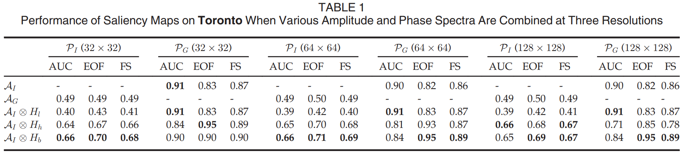
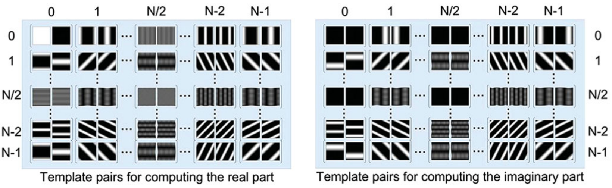
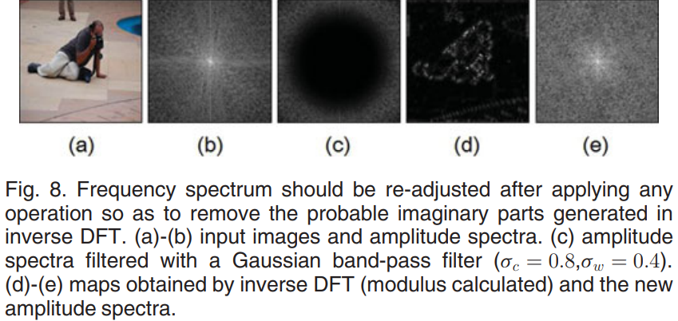
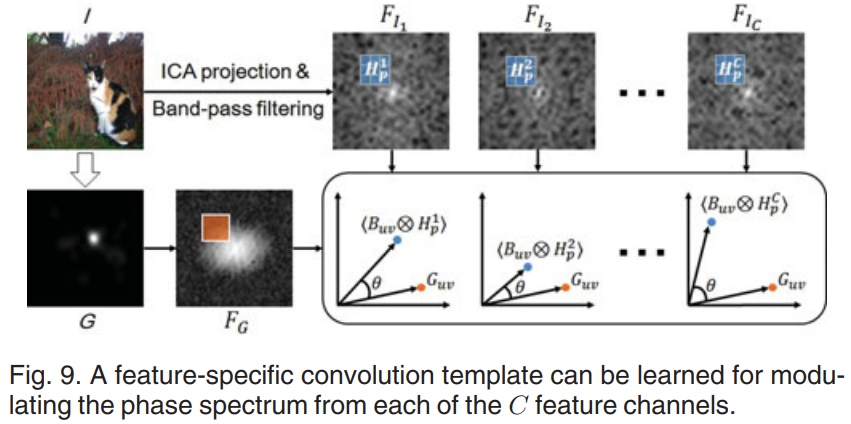

## Finding the Secret of Image Saliency in the Frequency Domain

Jia Li1, Ling-Yu Duan2, Xiaowu Chen1, Tiejun Huang3, Yonghong Tian3, IEEE transactions on ***pattern analysis and machine intelligence***, 2015

1. *Member, IEEE, School of Computer Science and Engineering, Beihang University*
2. *Member, IEEE, School of Electronics Engineering and Computer Science, Peking University*
3. *Senior Member, School of Electronics Engineering and Computer Science, Peking University*

目前研究 Image Saliency 的文献，均是在频域上进行操作的，但是并不清楚频域中的哪一部分对于识别 Saliency 是最关键的，振幅 or 相位。

本文的结论是 **the phases of intermediate frequencies** 是最重要的部分。并通过 **the template-based contrast computation** 的角度对 discrete Fourier transform 做了重构。说明了**实数和虚数部分的正负极为重要**。基于此，构造了 Saliency detector。

## The secret of Saliency

通过直接的 Qualitative 与 Quantitative study，说明了相位与振幅的相对重要性。

### Qualitative Study

the objective of saliency prediction is to generate a saliency map $S$ for an input image $I$ that perfectly approximates its fixation density map $G$

$$
\begin{equation}
    I\Rightarrow S\rightarrow G,
\end{equation}
$$

在频域上的表达为：

$$
\begin{equation}
    \mathscr{F}[I]\Rightarrow\mathscr{F}[S]\to\mathscr{F}[G],
\end{equation}
$$

也就是说，在频域上，$S$ 的振幅和相位都要靠近 $G$:

$$
\begin{equation}
    \mathcal{A}(F[S])\to\mathcal{A}(F[G]),\mathcal{P}(F[S])\to\mathcal{P}(F[G]),
\end{equation}
$$

集合 $I$ 中的东西是最拉的，$G$ 里的东西是最好使的，那么最拉的振幅配上最猛的相位和最拉的相位配上最猛的振幅，一下就能看出到底是谁在起作用，结果显示：**是相位在起作用**。

### Quantitative Study

延续上述 Quanlitative study，做了一些定量方面的研究，并加入了不同的滤波器，具体看一下相位重构结果如何：

1. 任何振幅范围与相位谱 $\mathcal{P}_G$ 的重构，都要好于用 $\mathcal{P}_I$ 做的重构
2. 带通滤波器表现最好
3. 图片 Resolution 影响不大

## Saliency detector

### A Template-Based Reinterpretation of DFT

目前我们知道了相位很重要，但是怎么个重要法还不是很理解。接下来我们对 DFT 的系数做分解，提供一条新的理解思路。

对于给定的图像 $I$，其 complex-valued Fourier coefficient at $u, v$ 估计系数如下：

$$
\begin{equation}
    F(u,v)=\sum_{x=0}^{N-1}\sum_{y=0}^{N-1}I(x,y)e^{i\theta},\theta=\frac{-2\pi(ux+vy)}N,
\end{equation}
$$

将 $e^{i\theta}$ 通过欧拉公式展开，并区分三角函数正负，则 $F(u,v)$ 实部与虚部可以写为如下形式：

$$
\begin{align}
    \begin{gathered}
    \Re(u,v)=\sum_{\cos\theta\geq0}\operatorname{cos}\theta I(x,y)+\sum_{\operatorname{cos}\theta<0}\operatorname{cos}\theta I(x,y), \\
    \begin{aligned}\Im(u,v)=\sum_{\sin\theta\geq0}\sin\theta I(x,y)+\sum_{\sin\theta<0}\sin\theta I(x,y).\end{aligned} 
    \end{gathered}
\end{align}
$$

这就是 DFT 系数的 **template-based contrasts**。也就是说，实部与虚部能够通过一些 template 表示：

$$
\begin{equation}
    \begin{aligned}\Re(u,v)&=\left\langle I\otimes\mathcal{T}_{uv}^{\Re+}\right\rangle-\left\langle I\otimes\mathcal{T}_{uv}^{\Re-}\right\rangle,\\\Im(u,v)&=\left\langle I\otimes\mathcal{T}_{uv}^{\Im+}\right\rangle-\left\langle I\otimes\mathcal{T}_{uv}^{\Im-}\right\rangle,\end{aligned}
\end{equation}
$$

其中，

$$
\begin{align}
\begin{gathered}
    \mathcal{T}_{uv}^{\Re+}(x,y) =\max(\cos\theta,0), \\
    \mathcal{T}_{uv}^{\Im+}(x,y) =\max(\sin\theta,0), \\
    \mathcal{T}_{uv}^{\Re-}(x,y) =\max(-\cos\theta,0), \\
    \mathcal{T}_{uv}^{\Im-}(x,y) =\max(-\sin\theta,0). 
\end{gathered}
\end{align}
$$

也就是说，这四个 templates 将 input 分为了两个**加权对比组**，下图就是一个例子

三角函数正负的分解只和频率有关，每种频率有固定的分割方式，如下图

低频会将图片分成较大的区域，过于 **粗糙**，高频又将图片分的过与 **精细**，均不利于图像 target 的识别，这也就是为什么中频表现最好。

> [!TIP|label:the sign of phase]
> 对于一个频率来说，表示为a+bi，他这种分解相当于把 a 和 b 都分解为了正负两个部分，增强其中有 target 的部分，压制没有 target 的部分，这样一来，实部a和虚部b的符号就会发生变换，这也就是为什么文章会说once correctly estimated signs of the real and the imaginary parts，从而， 相位的符号也就会发生变化，换言之，也就是相位变化后的符号中已经包含了target的信息，但是振幅永远都是正的，所以从符号正负的角度来说，振幅无法包含 target 的信息

### Construct the detector

对于训练集 dataset  $I$ 和 label $G$，有如下操作：

$$
F_I=\mathcal{N}(\mathscr{F}[I]\otimes H_{bh}),~F_G=\mathscr{F}[G],
$$

其中，$\mathcal{N}$ 代表频谱的调整，按原文说 *to generate only real-valued non-negative responses during inverse Fourier transform*：

$$
\hat{F}(u,v)=\frac1{N^2}\sum_{x=0}^{N-1}\sum_{y=0}^{N-1}e^{i\theta}\bigg|\sum_{u=0}^{N-1}\sum_{v=0}^{N-1}F(u,v)e^{-i\theta}\bigg|.
$$

**注意**，在上文的定义中 $\theta$ 已经包含了负数，因此，modulus 内其实是 IDFT，modulus 外才是 DFT。该操作的目的在于调整操作过的频谱：

### Phase Filter

$$
\min_{H_p^c}\sum_{(I,G)\in\mathbb{T}_c}\mathcal{L}\Big(\mathcal{P}(F_I*H_p^c),\mathcal{P}(F_G)\Big)
$$

$*$ 代表卷积。具体到操作层面，我们先对 $F_I$ 进行标准化，使得其振幅加和为1，这样**每个频率的振幅就代表了权重**。接着对于 $F_I$，sample 100 个 $M \times M$ 的 coefficient patches，令 $B_{uv}$ 表示以 $u,v$ 为中心的 patch，则 loss function 如下：

$$
\mathcal{L}\left(\mathcal{P}(F_I*H_p^c),\mathcal{P}(F_G)\right)=\sum_{B_{uv}\in F_I}w_{uv}\cdot\ell\Big(\langle B_{uv}\otimes H_p^c\rangle,F_G(u,v)\Big)
$$

$w_{uv}=|F_I(u,v)|$ 是非负权重，$\ell (\cdot)$ 是 **Cosine distance**，$H_p^c$ 中的参数是唯一需要被估计的，

> 之所以有 100 个 sample 是因为 ICA。

### Visual Saliency Estimation

得到了 phase filter 后，就得到了最终的相位谱：

$$
F_I^*=\mathcal{N}\left(F_I*H_p^c\right).
$$

To sum up，最终全流程为：

$$
\begin{equation}
    \begin{gathered}
    F_{I_{c}} =\mathcal{N}(\mathscr{F}[I_{c}]\otimes H_{bh}),~\forall c\in\{1,\ldots,C\}, \\
    F_{I_{c}}^{*} =\mathcal{N}\bigg(F_{I_c}*H_p^c\bigg),\forall c\in\{1,\ldots,C\}, \\
    \text{S} =\sum_{c=1}^{C}\bigg|\mathcal{F}^{-1}\bigg[\mathcal{N}\bigg(F_{I_{c}}^{*}\otimes H_{bl}\bigg)\otimes H_{bl}\bigg]\bigg|^{2}, 
    \end{gathered}
\end{equation}
$$

## Conclusion

这篇文章关于[相位的故事](#a-template-based-reinterpretation-of-dft)讲的很好，但是在最终也并没有直接对 $\cos,\sin$ 的正负进行操作，而是认为 label 中已经包含了正负的信息，从而直接去拟合对应的相位。

