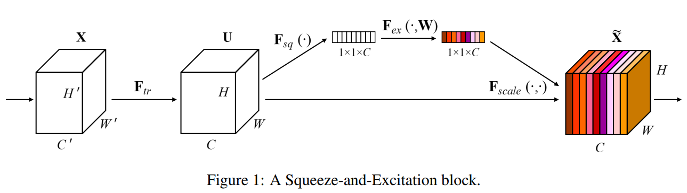

# Squeeze-and-Excitation Networks

Jie Hu1, Li Shen2, Gang Sun2, *CVPR*, 2018, Citation: **26k+**

1. *Momenta*
2. *Department of Engineering Science, University of Oxford*

> 由自动驾驶公司 Momenta 在 2017 年公布的一种全新的图像识别结构，它通过对特征通道间的**interdependencies** 进行建模，把重要的特征进行强化来提升准确率。这个结构是 2017 ILSVRC 的冠军。

SE block 并不是提出一个全新的网络结构，而是类似于一个即插即用的零件，能够很好地适配现有的网络架构，可以出现在网络的任何一层。

> [!NOTE|label:Why CNN for images]
> 1. High-dimensional data
> 2. Nearby image pixels are statistically related. However, fully connected networks have no notion of "nearby" and treat the relationship between every input equally.
> 3. The interpretation of an image is stable under geometric transformations. An image of a tree is still an image of a tree if we shift it leftwards by a few pixels.
>
> How about *attention* + **CNN**

SE Block 的结构如下：

顾名思义，该网络结构分为两步，Squeeze and Excitation。SE-net 是一种 attention 网络，select the most informative feature, and suppress the less useful ones. 

## SE net

### Squeeze: Global Information Embedding

$U$ 是通过 $X$ 进行卷积得到的 feature map：

$$
\begin{equation}
    \mathbf{u}_c=\mathbf{v}_c*\mathbf{X}=\sum_{s=1}^{C^{\prime}}\mathbf{v}_c^s*\mathbf{x}^s.
\end{equation}
$$

其中 $V$ 是可学习的 filter kernels $\mathbf{V}=[\mathbf{v}_1,\mathbf{v}_2,\ldots,\mathbf{v}_C]$。因为 $u_c$ 是 $v_c$ 对 $X$ 中的每一层进行卷积而得到的，因此捕捉到了全局（every channel）上的 $v_c$ 信息。

Squeeze 非常简单，就是对 $U$ 中每一个 Channel 做 Average Pooling：

$$
\begin{equation}
    z_c=\mathbf{F}_{sq}(\mathbf{u}_c)=\frac1{H\times W}\sum_{i=1}^H\sum_{j=1}^Wu_c(i,j).
\end{equation}
$$

其背后的含义就是我们对 $U$ 中的全局 feature 信息做了 **Embedding** 处理。

### Excitation: Adaptive Recalibration

> Which channel is more important than the other one

接着是第二步 Excitation，决定 Which channel is more important than the other one，想要实现这一步，需要函数有两个特性：

- **Flexible**: non-linear
- **Non-mutually-exclusive**: multiple channels are allowed to be emphasized opposed to one-hot activation [sigmoid of softmax]

therefore, we opt to employ a simple gating model:

$$
\begin{equation}
    \mathbf{s}=\mathbf{F}_{ex}(\mathbf{z},\mathbf{W})=\sigma(g(\mathbf{z},\mathbf{W}))=\sigma(\mathbf{W}_2\delta(\mathbf{W}_1\mathbf{z})),
\end{equation}
$$

where $\delta$ is ReLu，$\sigma$ is sigmoid。需要注意的是，$W_1,W_2$ 的维度分别为 $\mathbb{R}^{\frac{C}{r}\times C}, \mathbb{R}^{C \times\frac{C}{r}}$，$r$ 是reduction ratio，起到了 bottleneck 的效果。

Then the *final output* of the block is obtained by rescaling the transformation output $U$ with the activations:

$$
\begin{equation}
    \widetilde{\mathbf{x}}_c=\mathbf{F}_{scale}(\mathbf{u}_c,s_c)=s_c\cdot\mathbf{u}_c,
\end{equation}
$$

此处的 $s_c$ 是对于每一个 channel 而言的，因此，也就是相当于对 channels 调整了 **weights**。

### Examplars: SE-ResNet

该 module 能够很好地和现有方法相结合，例如 ResNet。

## Model and Computational Comlexity

There is a trade-off between model complexity and performance which is important for scalability. The reduction ratio $r$ is set to be **16** in all experiments.

### The role of Excitation

- The importance of feature channels is likely to be **shared** by different classes in the early stages of the network.
- At greater depth, the value of each channel becomes much more **class-specific** as different classes exhibit different preferences to the discriminative value of features

> [!NOTE|label:Reference]
> The two observations are consistent with findings in previous work: lower layer features are typically more general while higher layer features have greater specificity
> 
> 1. H. Lee, R. Grosse, R. Ranganath, and A. Y. Ng. Convolutional deep belief networks for scalable unsupervised learning of hierarchical representations. In ***ICML***, 2009.
> 2. J. Yosinski, J. Clune, Y. Bengio, and H. Lipson. How transferable are features in deep neural networks? In ***NIPS***, 2014

e 和 f 代表 SE_5_2, SE_5_3 are less important than previous blocks.

## Takeaway <!-- {docsify-ignore} -->

**SE-net**: select the most informative feature, and suppress the less useful ones.

