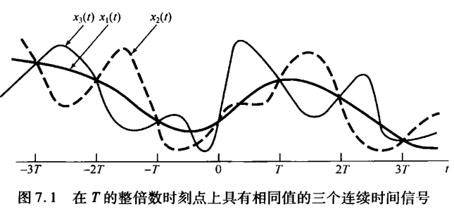
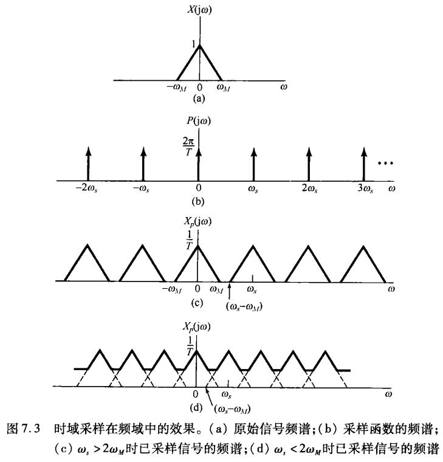

# Nyquist-Shannon Sampling Theorem

**采样定理的性质**

- 性质一：在一定条件下，一个连续时间信号**完全**可以用该信号在等时间间隔点上的值或样本(sample)来表示，并且可以用这些样本值把该信号全部恢复出来。

> 例如电影实际上是由单个画面组成的（一帧），每一帧都代表连续变化景象中的一个瞬时画面（也就是时间样本），当以足够快的速度来看这些时序样本时，就可以感觉到原来连续活动场景的重现。

- 性质二：采样定理的重要性还在于**在连续时间信号和离散时间信号之间所起的桥梁作用**。

> 如性质一所言，一个连续时间信号可以由其样本完全恢复出来，这样就提供了一个用离散时间信号来表示一个连续时间信号的想法。在很多方面离散时间信号的处理要更灵活方便些，因此往往比处理连续时间信号更为可取。

采样的概念使人们想到一种极富吸引力并广泛使用的方法：*可以利用采样先把一个连续时间信号变换为一个离散时间信号，再用一个离散时间系统将该离散时间信号进行处理，之后再把它变换回到连续时间中。*

## 采样定理

首先，我们可以看到，**有无限多个信号都可以产生一组给定的样本值**。

***那么如何确定一组样本值来源于哪一个信号呢？***

**采样定理**（Sampling Theorem）告诉我们：设 $x(t)$ 是一个带限信号，在 $|\omega|>\omega_{M}$ 时，$X(j\omega)=0$。如果 $\omega_{s}>2\omega_{M}$，其中 $\omega_{s}=2\pi/T$，那么 $x(t)$ 就唯一地由其样本 $x\left(nT\right),n=0,\pm1,\pm2,\cdots$ 所确定。

> **带限**：即该信号的傅里叶变换在某一有限频带范围以外均为零

如果已知这些样本值，我们就能通过如下方法重建 $x(t)$：产生一个周期冲激串，其冲击幅度就是这些依次而来的样本值；然后将该冲激串通过一个增益为 $T$，截止频率大于 $\omega_M$ 而小于 $\omega_s-\omega_M$ 的理想低通滤波器，该滤波器的输出就是 $x(t)$。

在采样定理中所要求的采样频率 $\omega_s > 2\omega_M$，频率 $2\omega_M$ 一般称为**奈奎斯特率**，而对于 $1/2$ 奈奎斯特率的频率 $\omega_M$ 往往称之为**奈奎斯特频率**。

### 冲激串采样

为了建立采样定理，需要一种方便的方式来表示**一个连续时间信号在均匀间隔上的采样**。一种有用的办法是通过用一个周期冲激串去乘带采样的连续时间信号 $x(t)$，这一方法称为冲激串采样（impluse-train sampling），如图所示：

也即：

$$
\begin{equation}
    x_{p}(t)=x(t)p(t), \quad p(t)=\sum_{n=-\infty}^{+\infty}\delta(t-nT)
\end{equation}
$$

其中，该周期冲激串 $p(t)$ 称为**采样函数**（Sampling function），周期 $T$ 称为采样周期，频率 $\omega_s = 2 \pi /T$ 称为采样频率。

> [!NOTE|label:单位脉冲函数]
$$
\left.\delta[n]=\left\{\begin{array}{ll}0,&n\neq0\\1,&n=0\end{array}\right.\right.
$$
>

$x(t)$ 被一个单位冲激函数相乘后，就可以将冲击发生的这一点信号值采出来，即：

$$
x\left(t\right)\delta\left(t-t_{0}\right)=x\left(t_{0}\right)\delta\left(t-t_{0}\right),
$$

因此 $x_p(t)$ 本身就是一个冲激串，其冲激的幅度等于 $x(t)$ 在以 $T$ 为间隔处的样本值，即：

$$
x_{p}(t)=\sum_{n=-\infty}^{+\infty}x(nT)\delta(t-nT)
$$

由傅里叶变换的相乘性质可知：

$$
X_{p}(j\omega)=\frac{1}{2\pi}\int_{-\infty}^{+\infty}X(j\omega)P(j(\omega-\theta))\mathrm{d}\theta 
$$

> [!NOTE|label:相乘性质]
> 卷积性质：**时域内的卷积对应于频域内的相乘**。
> 
> 由于时域和频域之间的对偶性，对此也有一个相应的对偶性质存在：即**时域内的相乘对应于频域内的卷积**。

由于冲激函数特性 $P(j\omega)=\frac{2\pi}{T}\sum_{k=-\infty}^{+\infty}\delta(\omega-k\omega_{s})$，且信号与一个单位冲激函数的卷积就是该信号的移位 $X(\mathrm{j}\omega)*\delta(\omega-\omega_{0})=X(\mathrm{j}(\omega-\omega_{0}))$，于是有：

$$
\begin{equation}
    X_{p}(j\omega)=\frac{1}{T}\sum_{k=-\infty}^{+\infty}X(j(\omega-k\omega_{s}))
\end{equation}
$$

这就是说，$X_{p}(j\omega)$ 是频率 $\omega$ 的周期函数，它由一组移位的 $X(j\omega)$ 的叠加而成，但在幅度上标以 $1/T$ 的变化。

当 $\omega_s > 2\omega_M$ 时，采样信号的频谱是由 $x(t)$ 的频谱**重复组成**的，而这正是采样定理的基础。

然而，如图 (d) 所示，如果当 $\omega_s < 2\omega_M$ 时，$x(t)$ 的频谱 $X(j\omega)$ 不再在 $X_{_p}(\mathrm{j}\omega)$ 中重复，因此低通滤波也就不再能把 $x(t)$ 从采样信号中恢复出来。此时，式 (2) 的那些单项发生重叠，这一现象称之为混叠（*Aliasing*）。

**To sum up**：对一组连续信号进行采样后，得到的频谱会呈现重复的特征，如果确保采样频率 $\omega_s > 2\omega_M$，那么通过低通滤波就可以恢复原有信号。

## 采样与分解

