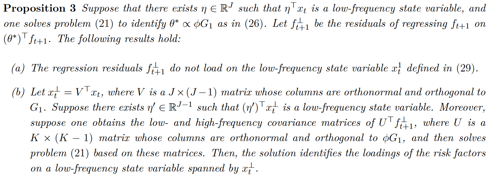

# Low-Frequency Risk Factors and Their Fundamental Drivers

Sicong Li, London Business School, Working paper, 2024.

Motivation: *Many variables that drive the variation of risk premia in theoretical asset-pricing models and those conventionally used for empirical return prediction are persistent*

## Method

股票收益率符合以下 DGP，$f$ 代表因子。

$$
\begin{equation}
\underbrace{r_{t+1}}_{N\times1}=\underbrace{\beta_t}_{N\times K}\underbrace{f_{t+1}}_{K\times1}+\underbrace{\varepsilon_{t+1}}_{N\times1},
\end{equation}
$$

而这些因子是由 $J$ 个无法观测到的 state variable 生成的，并且 $\mathbb{E}[x_t]=0$

$$
\begin{equation}
    \underbrace{f_{t+1}}_{K\times1}=\underbrace{\mu_f}_{K\times1}+\underbrace{\phi}_{K\times J}\underbrace{x_t}_{J\times1}+\underbrace{\xi_{t+1}}_{K\times1},
\end{equation}
$$

关于 state variable 的假设说明 risk premium 是时变的。

因此股票的条件预期收益率的变化是由**风险**和**风险溢价**的变化导致的

$$
\mathbb{E}_t\left[r_{t+1}\right]=\beta_t\left(\mu_f+\phi x_t\right),
$$

## Risk factors with time-varying risk premia

State variable 本身是不可观测的，但是可以通过方法估计出 state variable 的 loading。

假设只有一个 state variable 有时变的 risk premium。将因子的协方差标准化为单位矩阵并且，且 loading 长度为一，即 $\Sigma_f=\mathbf{I}_K$ 且 $\phi^\top\phi=1$，并且 $\Lambda$ 是一个 $K \times (K-1)$ 维正交矩阵，且与 $\phi$ 正交，那么 $\Lambda^\top\Lambda=\mathbf{I}_{K-1}$ 且 $\Lambda^\top\phi=\mathbf{0}$，则有

$$
\begin{align}
\phi^\top f_{t+1}=\phi^\top\mu_f+x_t+\phi^\top\xi_{t+1},\\ 
\Lambda^\top f_{t+1}=\Lambda^\top\mu_f+\mathbf{0}+\Lambda^\top\xi_{t+1}.
\end{align}
$$

$\phi^\top f_{t+1}$ 则是唯一一个由 state variable 驱动，有着时变风险溢价的风险因子，$\Lambda^\top f_{t+1}$ 则是其余 $K-1$ 个有着 constant 风险溢价的因子。

通过 $\phi$ 对这些因子进行综合，可以提高信噪比，因为自变量解释方差的程度提升了

$$
\begin{equation}
    \frac{\text{trace}\left(\phi\phi^\top\sigma_x^2\right)}{\text{trace}\left(\Sigma_f\right)}=\frac{\sigma_x^2}{K}<\frac{\sigma_x^2}{\mathbb{V}ar\left(\phi^\top f_{t+1}\right)}=\sigma_x^2,
\end{equation}
$$

在通过 $\phi$ 进行综合风险因子前后的夏普比率可以表达如下

$$
\begin{align}
\mathrm{SR}_f&=\left(\mu_f^\top\Sigma_\xi^{-1}\mu_f\right)^{1/2} \\
\mathrm{SR}_{\phi^\top f}&=\left[\left(\phi^\top\mu_f\right)^\top\left(\phi^\top\Sigma_\xi\phi\right)^{-1}\left(\phi^\top\mu_f\right)\right]^{1/2}
\end{align}
$$

并且有 $\mathrm{SR}_\phi\top_f\leq\mathrm{SR}_f$，二者的比值可以反映出**时变的风险因子对整体的夏普比率贡献了多少**。举例来说，如果 $\mu_f$ is proportional to $\phi$，那么所有的夏普比率都来自于时变的 state variable，即 $\Lambda^\top\mu_f=\mathbf{0}$。

 Derivation 

因为 $\mathbf{I}_K=\Sigma_f=\phi\Sigma_x\phi^\top+\Sigma_\xi$，代入得

$$
\begin{aligned}
\mu_{f}^{\top}\Sigma_{\xi}^{-1}\mu_{f}& =\mu_f^\top\left(\mathbf{I}_K-\phi\Sigma_x\phi^\top\right)^{-1}\mu_f  \\
&=\mu_f^\top\left[\mathbf{I}_K-\phi\left(\mathbf{I}_J-\Sigma_x^{-1}\right)^{-1}\phi^\top\right]\mu_f \\
&=\mu_f^\top\mu_f-\mu_f^\top\phi\left(\mathbf{I}_J-\Sigma_x^{-1}\right)^{-1}\phi^\top\mu_f,
\end{aligned}
$$

其中，第二行的推导使用了 Woodbury 恒等式。

> [!NOTE|label:Woodbury Identity]
> Woodbury 恒等式，也称为矩阵求逆引理（Matrix Inversion Lemma），是线性代数中的一个非常有用的公式，特别在涉及大规模矩阵运算的应用中，这个恒等式提供了一种计算大矩阵的逆的简化方法，尤其是当矩阵可以表示为一个低秩更新的形式时。
$$
(A+UCV)^{-1}=A^{-1}-A^{-1}U(C^{-1}+VA^{-1}U)^{-1}VA^{-1}
$$
> 其中 $A$ 是一个 $n \times n$ 可逆矩阵，$U$ 是一个 $n \times k$ 矩阵，$C$ 是一个 $k \times k$ 可逆矩阵，$V$ 是一个 $k \times n$ 矩阵。

类似地，

$$
\begin{aligned}
\mu_f^\top\phi\left[\phi^\top\Sigma_\xi\phi\right]^{-1}\phi^\top\mu_f& \begin{aligned}&=\mu_{f}^{\top}\phi\left(\mathbf{I}_{J}-\Sigma_{x}\right)^{-1}\phi^{\top}\mu_{f}\end{aligned}  \\
&=\mu_f^\top\phi\left[\mathbf{I}_J-\left(\mathbf{I}_J-\Sigma_x^{-1}\right)^{-1}\right]\phi^\top\mu_f \\
&=\mu_f^\top\phi\phi^\top\mu_f-\mu_f^\top\phi\left(\mathbf{I}_J-\Sigma_x^{-1}\right)^{-1}\phi^\top\mu_f.
\end{aligned}
$$

此时，注意到因为 $\mathbf{I}_J-\Sigma_x^{-1}$ 是负定矩阵，因此 $c=-\mu_f^\top\phi\left(\mathbf{I}_J-\Sigma_x^{-1}\right)^{-1}\phi^\top\mu_f>0$，所以

$$
\frac{\mu_f^\top\phi\left[\phi^\top\Sigma_\xi\phi\right]^{-1}\phi^\top\mu_f}{\mu_f^\top\Sigma_\xi^{-1}\mu_f}=\frac{\mu_f^\top\phi\phi^\top\mu_f+c}{\mu_f^\top\mu_f+c}\geq\frac{\mu_f^\top\phi\phi^\top\mu_f}{\mu_f^\top\mu_f},
$$

**Proposition 1**：假设 $\sum_f=\mathbf{I}_K, \phi^\top\phi=\mathbf{I}_J$ 则有

$$
\begin{equation}
\frac{SR_{\phi^\top f}}{SR_f}\geq\frac{\|\phi^\top\mu_f\|_2}{\|\mu_f\|_2}.
\end{equation}
$$

特别地，当 $\mu_f\in span(\phi)$ 时，不等式取等号。不等式右侧就是这一贡献比率的 lower bound。

## Frequency-specific risk factors

但是即使识别出了因子在 state variable 上的 loading，也不能得到关于频率的信息，所以需要对原本的 state variable 再进行组合，得到 frequency state variable

$$
\begin{equation}
    f_{t+1}=\mu_f+\phi GG^\top x_t+\xi_{t+1},
\end{equation}
$$

其中 $G$ 就携带了关于频率的信息，是 $J \times J$ 维的旋转矩阵，满足 $GG^\top=G^\top G=\mathbf{I}_J$，则同理得到

$$
\begin{equation}
    G^\top\phi^\top f_{t+1}=G^\top\phi^\top\mu_f+G^\top x_t+G^\top\phi^\top\xi_{t+1}.
\end{equation}
$$

 Basic concepts in Fourier 

对于自协方差相关性矩阵进行傅里叶分解有

$$
\begin{equation}
    \mathbf{g}_f\left(\omega\right)=\sum_{k=-\infty}^\infty\Sigma_f\left(k\right)e^{-i\omega k},
\end{equation}
$$

同样，逆傅里叶变换有

$$
\begin{equation}
    \Sigma_f\left(k\right)=\frac{1}{2\pi}\int_{-\pi}^{\pi}\mathbf{g}_f\left(\omega\right)e^{i\omega k}d\omega.
\end{equation}
$$

那么协方差就可以写为

$$
\begin{equation}
    \Sigma_f=\Sigma_f\left(0\right)=\frac{1}{2\pi}\int_{-\pi}^{\pi}\mathbf{g}_f\left(\omega\right)d\omega.
\end{equation}
$$

根据 Spectral Representation Theorem，任何协方差平稳且均值为零的时间序列 $X_t$ 都可以被表示为

$$
\begin{equation}
    X_t=\int_{-\pi}^{\pi}e^{i\omega t}dZ\left(\omega\right)=\int_{-\pi}^{\pi}\left[\cos\left(\omega t\right)+i\sin\left(\omega t\right)\right]dZ\left(\omega\right),
\end{equation}
$$

> Brockwell, Peter J., and Richard A. Davis, 2009, Time Series: Theory and Methods (Springer Science & Business Media).

并且 $Z(\omega)$ 满足

$$
\begin{equation}
    \mathbb{Var}\left[Z\left(\omega_2\right)-Z\left(\omega_1\right)\right]=\frac{1}{2\pi}\int_{\omega_1}^{\omega_2}g_X\left(\omega\right)d\omega,
\end{equation}
$$

其中 $Z(\omega)$ 是复数域上的均值为零随机过程，$g_X(\omega)$ 是 $X_t$ 的 spectral density function。

基于式（13），自然可以把协方差分配到不同频率上

$$
\begin{equation}
    \begin{aligned}\Sigma_f&=\underbrace{\frac{1}{2\pi}\int_{[-\omega,\omega]}\mathbf{g}_f\left(\lambda\right)d\lambda}_{\Sigma_f^{\mathrm{LF}}}+\underbrace{\frac{1}{2\pi}\int_{[-\pi,-\omega)\cup(\omega,\pi]}\mathbf{g}_f\left(\lambda\right)d\lambda}_{\Sigma_f^{\mathrm{HF}}},\end{aligned}
\end{equation}
$$

对于 factor innovation $\xi_{t+1}$ 来说，因为其 conditionally uncorrelated，所以其自协方差矩阵满足 $\begin{aligned}\Sigma_\xi(k)=\mathbf{0}\text{ for }k\neq0\end{aligned}$，因此其谱密度矩阵为

$$
\begin{equation}
    \mathbf{g}_\xi\left(\omega\right)=\sum_{k=-\infty}^\infty\Sigma_\xi\left(k\right)e^{-i\omega k}=\Sigma_\xi,
\end{equation}
$$

与频率无关。

又因为 $\Sigma_f=\phi\Sigma_x\phi^\top+\Sigma_\xi$，所以可以写为

$$
\begin{equation}
\Sigma_f=\frac1{2\pi}\int_{-\pi}^\pi\phi\mathbf{g}_x\left(\omega\right)\phi^\top d\omega+\Sigma_\xi=\frac1{2\pi}\int_{-\pi}^\pi\left[\phi\mathbf{g}_x\left(\omega\right)\phi^\top+\Sigma_\xi\right]d\omega.
\end{equation}
$$

谱密度之间的关系为

$$
\begin{equation}
    \mathbf{g}_f\left(\omega\right)=\phi\mathbf{g}_x\left(\omega\right)\phi^\top+\Sigma_\xi.
\end{equation}
$$

因此低频与高频协方差矩阵可以写为

$$
\begin{align}
\Sigma_f^{\mathrm{LF}}&=\phi\underbrace{\left(\frac{1}{2\pi}\int_{[-\omega,\omega]}\mathbf{g}_x\left(\lambda\right)d\lambda\right)}_{\Sigma_x^{\mathrm{LF}}}\phi^\top+\frac{\omega}{\pi}\Sigma_\xi, \\
\Sigma_f^{\text{HF}}&=\phi\underbrace{\left(\frac{1}{2\pi}\int_{[-\pi,-\omega)\cup(\omega,\pi]}\mathbf{g}_x\left(\lambda\right)d\lambda\right)}_{\Sigma_x^{\text{HF}}}\phi^\top+\frac{\pi-\omega}{\pi}\Sigma_\xi
\end{align}
$$

如果 state variable 与频率也无关，那么对于任何 risk factor 的线性组合 $\theta$，低频方差比上高频方差都会是一个常数

$$
\begin{equation}
    \frac{\theta^\top\Sigma_f^{\mathrm{LF}}\theta}{\theta^\top\Sigma_f^{\mathrm{HF}}\theta}=\frac{\theta^\top\phi\left(\frac1{2\pi}\int_{[-\omega,\omega]}\mathbf{g}_x\left(\lambda\right)d\lambda\right)\phi^\top\theta+\frac\omega\pi\theta^\top\Sigma_\xi\theta}{\theta^\top\phi\left(\frac1{2\pi}\int_{[-\pi,-\omega)\cup(\omega,\pi]}\mathbf{g}_x\left(\lambda\right)d\lambda\right)\phi^\top\theta+\frac{\pi-\omega}\pi\theta^\top\Sigma_\xi\theta}=\frac\omega{\pi-\omega},
\end{equation}
$$

但是根据现有文献的结果，state variable 在不同频率上的表现是不一致的。例如 Campbell and Cochrane (1999) 指出 state variable is highly persistent，这说明其在低频的谱密度要更高。因此 state variable 不同频率方差的比值应该大于这一数值

$$
\begin{equation}
    \frac{\left(\sigma_{x}^{2}\right)^{{\mathrm{LF}}}}{\left(\sigma_{x}^{2}\right)^{{\mathrm{HF}}}}>\frac\omega{\pi-\omega}.
\end{equation}
$$

> Campbell, John Y., and John H. Cochrane, 1999, By force of habit: A consumption-based explanation of aggregate stock market behavior, ***Journal of Political Economy*** 107, 205–251.

所以 $\frac{\theta^\top\Sigma_f^{\mathrm{LF}}\theta}{\theta^\top\Sigma_f^{\mathrm{HF}}\theta}$ 会大于区间长度比例。那么这个比例能有多大呢？不知道，但是可以通过优化，让他越大越好，得到一个数值上的极限。

> 那最后得到的 $\theta$ 该怎么理解呢？

因为对于 state variable 来说，低频方差比上高频方差，这一个比例是固定的，所以最大化的就是组合因子（state variable）的低频高频比，也就是说，最后得到的，是通过 $\theta$ 对原有因子进行组合后得到的一个频率因子，因子的性质由最大化的内容决定。

该优化问题可以写为：

$$
\begin{align}
\begin{aligned}&\max_{c,\theta}\quad c,\\&\mathrm{s.t.}\quad\theta^\top\left(\Sigma_f^{\mathrm{LF}}-c\Sigma_f^{\mathrm{HF}}\right)\theta\geq0.\end{aligned}
\end{align}
$$

进一步，**low frequency state variable 的存在**可以转化为以下这个问题，

**Lemma 1** 

矩阵

$$
\begin{equation}
    W=\left(\mathbf{I}_J-\Sigma_x+\frac{\pi}{\pi-\omega}\Sigma_x^{HF}\right)^{-1/2}\left(\mathbf{I}_J-\Sigma_x+\frac{\pi}{\omega}\Sigma_x^{LF}\right)\left(\mathbf{I}_J-\Sigma_x+\frac{\pi}{\pi-\omega}\Sigma_x^{HF}\right)^{-1/2}
\end{equation}
$$

的最大特征值大于一 **当且仅当** 存在 $\eta\in\mathbb{R}^J$ 满足

$$
\begin{equation}
    \frac{\eta^\top\Sigma_x^{LF}\eta}{\eta^\top\Sigma_x^{HF}\eta}>\frac\omega{\pi-\omega}.
\end{equation}
$$

这一形式代表通过 $\eta$ 对 state variable 进行组合后的 low frequency state variable，在低频上的方差大于在高频上的方差。

如果通过 Proposition 1 保证 low-frequency state variable 的存在，那么通过 Proposition 2 就可以求解出 risk factors 在该 state variable 上的 loading。

 Derivation 

> [!TIP|label:Derivation]
$$
\frac{\eta^\top\Sigma_x^{\mathrm{LF}}\eta}{\eta^\top\Sigma_x^{\mathrm{HF}}\eta}>\frac\omega{\pi-\omega}\Leftrightarrow\frac{\eta^\top\frac\pi\omega\Sigma_x^{\mathrm{LF}}\eta}{\eta^\top\frac\pi{\pi-\omega}\Sigma_x^{\mathrm{HF}}\eta}>1
$$ 
> 因为 $\mathbf{I}_J-\Sigma_x=\mathbb{V}ar(\phi^\top f_{t+1})-\Sigma_x=\phi^\top\Sigma_\xi\phi $，所以 $\mathbf{I}_J-\Sigma_x$ 是正定的，上述不等式可以转化为
$$
\frac{\eta^\top\left(\frac{\pi}{\omega}\Sigma_x^{\mathrm{LF}}+\mathbf{I}_J-\Sigma_x\right)\eta}{\eta^\top\left(\frac{\pi}{\pi-\omega}\Sigma_x^{\mathrm{HF}}+\mathbf{I}_J-\Sigma_x\right)\eta}>1
$$
> 然后关键的来了，定义了两个新变量，
$$
\begin{aligned}
v&=\left(\frac\pi{\pi-\omega}\Sigma_x^\text{HF}+\mathbf{I}_J-\Sigma_x\right)^{1/2}\eta \\
W&=\left(\frac{\pi}{\pi-\omega}\Sigma_x^{\mathrm{HF}}+\mathbf{I}_J-\Sigma_x\right)^{-1/2}\left(\frac{\pi}{\omega}\Sigma_x^{\mathrm{LF}}+\mathbf{I}_J-\Sigma_x\right)\left(\frac{\pi}{\pi-\omega}\Sigma_x^{\mathrm{HF}}+\mathbf{I}_J-\Sigma_x\right)^{-1/2}
\end{aligned}
$$
> 问题最终转化为
$$
\frac{\eta^\top\Sigma_x^\text{LF}\eta}{\eta^\top\Sigma_x^\text{HF}\eta}>\frac\omega{\pi-\omega}\Leftrightarrow\frac{v^\top Wv}{v^\top v}>1,
$$
> 之所以要写成这种形式，是因为要借助瑞利商的形式进行分析。瑞利商的定义是一个标量函数，它讲任意非零向量 $v$ 映射到一个实数，对于一个给定的实对称矩阵 $W$，瑞利商 $R(v)$ 定义为
$$
R(v)=\frac{v^TWv}{v^Tv}
$$
> 这里 $v^T W v$ 是一个标量，表示向量 $v$ 在矩阵 $W$ 变换下的二次型；$v^Tv$ 也是一个标量，它是向量 $v$ 的欧几里得范数的平方。因此，瑞利商本身是一个标量比率，反映了 $v$ 相对于 $W$ 的平均拉伸。
>
> 当 $v$ 是 $W$ 的特征向量时，$R(v,W)$ 就等于对应的特征值，并且，瑞利商 $R(v)$ 的取值范围就是矩阵 $W$ 的最小特征值到最大特征值。最大值是 $W$ 的最大特征值 $\lambda_{\max}$，即 $\max_{v \neq 0} R(v) = \lambda_{\max} $，当 $v$ 是对应于 $W$ 的最大特征值的特征向量时，瑞利商取得这个最大值。
>
> 所以这个矩阵内部的形式并没有太多意义，只是为了凑出来瑞利商的形式。
> 

如果通过 lemma 1 证明了 low-frequency state variable 的存在，那么下一步就可以开始求解了。

因为最优化问题在约束条件的边界处取得最优值 (binding at the optimum)，所以令约束条件等于零得

$$
\quad\theta^\top\Sigma_f^{\mathrm{LF}}\theta-c\theta^T\Sigma_f^{\mathrm{HF}}\theta = 0
$$

又因为

$$
\begin{aligned}
    \Sigma_f^{\mathrm{LF}}&=\phi\Sigma_x^{\mathrm{LF}}\phi^\top+\frac\omega\pi\Sigma_\xi,\\
    \Sigma_f^{\mathrm{HF}}&=\phi\Sigma_x^{\mathrm{HF}}\phi^\top+\frac{\pi-\omega}\pi\Sigma_\xi 
\end{aligned}
$$

代入得

$$
\begin{aligned}
    &\theta^\top\left[\frac\omega\pi\Sigma_\xi+\phi\Sigma_x^\mathrm{LF}\phi^\top\right]\theta-c\theta^\top\left[\frac{\pi-\omega}\pi\Sigma_\xi+\phi\Sigma_x^\mathrm{HF}\phi^\top\right]\theta=0 \\
    \Rightarrow\quad &c=\frac\omega{\pi-\omega}\frac{\theta^\top\left(\mathbf{I}_K-\phi\Sigma_x\phi^\top+\frac\pi\omega\phi\Sigma_x^\mathrm{LF}\phi^\top\right)\theta}{\theta^\top\left(\mathbf{I}_K-\phi\Sigma_x\phi^\top+\frac\pi{\pi-\omega}\phi\Sigma_x^\mathrm{HF}\phi^\top\right)\theta}
\end{aligned}
$$

因为 $\phi$ 和 $\Lambda$ 是正交的，所以有

$$
\mathbf{I}_K=\Lambda\Lambda^\top+\phi\phi^\top 
$$

因此原式就可以进一步拆分为

$$
c=\frac\omega{\pi-\omega}\frac{\theta^\top\begin{bmatrix}\phi,&\Lambda\end{bmatrix}\begin{bmatrix}\mathbf{I}_J-\Sigma_x+\frac\pi\omega\Sigma_x^\mathrm{LF}&\mathbf{0}\\\mathbf{0}&\mathbf{I}_{K-J}\end{bmatrix}\begin{bmatrix}\phi^\top\\\Lambda^\top\end{bmatrix}\theta}{\theta^\top\begin{bmatrix}\phi,&\Lambda\end{bmatrix}\begin{bmatrix}\mathbf{I}_J-\Sigma_x+\frac\pi{\pi-\omega}\Sigma_x^\mathrm{HF}&\mathbf{0}\\\mathbf{0}&\mathbf{I}_{K-J}\end{bmatrix}\begin{bmatrix}\phi^\top\\\Lambda^\top\end{bmatrix}\theta}
$$

看着形式十分之复杂，但是不要慌，我们仍然使用瑞利商，将其和 lemma 1 中的形式对应起来，令

$$
z=\begin{bmatrix}\phi,&\Lambda\end{bmatrix}\begin{bmatrix}\left(\mathbf{I}_J-\Sigma_x+\frac{\pi}{\pi-\omega}\Sigma_x^{\mathrm{HF}}\right)^{1/2}&\mathbf{0}\\\mathbf{0}&\mathbf{I}_{K-J}\end{bmatrix}\begin{bmatrix}\phi^\top\\\Lambda^\top\end{bmatrix}\theta 
$$

因此

$$
\theta=\begin{bmatrix}\phi,&\Lambda\end{bmatrix}\begin{bmatrix}\left(\mathbf{I}_J-\Sigma_x+\frac{\pi}{\pi-\omega}\Sigma_x^{\mathrm{HF}}\right)^{-1/2}&\mathbf{0}\\\mathbf{0}&\mathbf{I}_{K-J}\end{bmatrix}\begin{bmatrix}\phi^\top\\\Lambda^\top\end{bmatrix}z.
$$

因此原式转化为

$$
\begin{gathered}c=\frac\omega{\pi-\omega}\frac{z^\top\begin{bmatrix}\phi,&\Lambda\end{bmatrix}\begin{bmatrix}W&\mathbf{0}\\\mathbf{0}&\mathbf{I}_{K-J}\end{bmatrix}\begin{bmatrix}\phi^\top\\\Lambda^\top\end{bmatrix}z}{z^\top z},\end{gathered}
$$

这个 $W$ 就是上文 Lemma 1 中的形式。

对 $W$ 进行特征值分解，

$$
\begin{aligned}
    W&=HD_WH^\top, \\
    \phi W \phi^T&= (\phi H) D_W (\phi H)^T
\end{aligned}
$$

如果把特征值分解的结果带入，$c$ 可以进一步写为

$$
\begin{gathered}c=\frac{\omega}{\pi-\omega}\frac{z^\top\begin{bmatrix}\phi H,&\Lambda\end{bmatrix}\begin{bmatrix}D_W&\mathbf{0}\\\mathbf{0}&\mathbf{I}_{K-J}\end{bmatrix}\begin{bmatrix}H^\top\phi^\top\\\Lambda^\top\end{bmatrix}z}{z^\top z}.\end{gathered}
$$

如果要最大化 $c$，也就是最大化瑞利商，根据瑞利商的性质，最大值就是 $W$ 的最大特征值，根据 Lemma 1，如果该特征值大于 1，那么就说明存在 low-frequency state variable，因此，如果最大特征值 $\lambda_1^W$ 大于 1，最优解为

$$
\begin{equation}
c^*=\frac\omega{\pi-\omega}\lambda_1^W,
\end{equation}$$

那么 $z$ 就是对应的特征向量 $H_1$，因此 $\theta$ 为

$$
\begin{equation}
\begin{aligned}&\theta^*\propto\begin{bmatrix}\phi,&\Lambda\end{bmatrix}\begin{bmatrix}\left(\mathbf{I}_J-\Sigma_x+\frac\pi{\pi-\omega}\Sigma_x^{\mathrm{HF}}\right)^{-1/2}&\mathbf{0}\\\mathbf{0}&\mathbf{I}_{K-J}\end{bmatrix}\begin{bmatrix}\phi^\top\\\Lambda^\top\end{bmatrix}\phi H_1\\&=\phi\left(\mathbf{I}_J-\Sigma_x+\frac\pi{\pi-\omega}\Sigma_x^{\mathrm{HF}}\right)^{-1/2}H_1.\end{aligned}
\end{equation}$$

> [!NOTE|label:Propotion]
> 因为对于原优化问题来说，$\theta$ 并不唯一，任意与 $\theta^*$ 成比例缩放的向量均可以。

但如果 $\lambda_1^W$ 小于 1，那么 $c$ 的最大值就为

$$
\begin{equation}
    c^*=\frac\omega{\pi-\omega},
\end{equation}
$$

而 $\theta$ 只需要是与 $W$ 无关的任意向量就可以了

$$
\begin{equation}
    \theta^*\propto\begin{bmatrix}\phi,&\Lambda\end{bmatrix}\begin{bmatrix}\left(\mathbf{I}_J-\Sigma_x+\frac{\pi}{\pi-\omega}\Sigma_x^{\mathrm{HF}}\right)^{-1/2}&\mathbf{0}\\\mathbf{0}&\mathbf{I}_{K-J}\end{bmatrix}\begin{bmatrix}\phi^\top\\\Lambda^\top\end{bmatrix}\Lambda x=\Lambda x.
\end{equation}
$$

既然求解出了 $G$，那么通过**标准化**，最终得到的 low-frequency state variable 就是

$$
\begin{equation}
    x_t^1=\frac1{\|G_1\|_2}G_1^\top x_t.
\end{equation}
$$

受 low-frequency state variable 驱动的 low-frequency factor 就是，

$$
\begin{equation}
    \left(\theta^*\right)^\top f_{t+1}=x_t^1+\frac{G_1^\top\phi^\top\xi_{t+1}}{\|G_1\|_2},
\end{equation}
$$

> 这块应该是还有个 $\mu_f$ 项，但是没写出来。

对于上面的结果，总结来说就是

**Part (a)** 用来说明 $(\theta^*)^T f_{t+1} $ 完全携带了 low-frequency state variable 携带的定价信息。

用 $f_{t+1}^\perp$ 表示将 $f_{t+1}$ 回归到 $(\theta^*)^T f_{t+1} $ 上的残差，即

$$
f_{t+1}^\perp=\left(\mathbf{I}_K-\frac{\phi G_1G_1^\top\phi^\top}{G_1^\top G_1}\right)f_{t+1}.
$$

其中 $\frac{\phi G_1G_1^\top\phi^\top}{G_1^\top G_1}$ 是一个投影矩阵，投到由 $\phi G_1$ 张成的空间，$\left(\mathbf{I}_K-\frac{\phi G_1G_1^\top\phi^\top}{G_1^\top G_1}\right)$ 表示该空间的正交补空间。

> $P = X(X^TX)^{-1}X^T$

那么 state variable 在上面的投影就是

$$
\begin{aligned}
\begin{aligned}\left(\mathbf{I}_{K}-\frac{\phi G_{1}G_{1}^{\top}\phi^{\top}}{G_{1}^{\top}G_{1}}\right)\phi x_{t}\end{aligned}& =\phi\left(\mathbf{I}_{J}-\frac{G_{1}G_{1}^{\top}}{G_{1}^{\top}G_{1}}\right)x_{t}  \\
&=\phi VV^\top x_t\equiv\phi^\perp x_t^\perp,
\end{aligned}
$$

其中 $V$ 是 $J \times (J-1)$ 维的正交矩阵，并且与 $G_1$ 正交，$x_t^\perp=V^\top x_t, \phi^\perp=\phi V$，因为与 $G_1$ 正交，所以肯定在 $x_1$ 上不存在 loading，他还给了一个证明

$$
\begin{aligned}
    &\phi VV^\top\begin{bmatrix}\frac{G_1}{\|G_1\|}&V\end{bmatrix}\begin{bmatrix}\frac{G_1^\top}{\|G_1^\top\|}\\V^\top\end{bmatrix}x_t \\
    =&\frac1{\|G_1\|^2}\phi V\underbrace{V^\top G_1}_{=0_{J-1}}G_1^\top x_t+\phi VV^\top x_t,
\end{aligned}
$$

**Part (b)** 是用来说明，最优化问题可以 **recursively** identify risk factors on other low frequency state variables。

直接将残差表示为

$$
f_{t+1}^\perp=UU^\top f_{t+1}.
$$

> $UU^T$ 代表的是 $\phi G_1$ 的正交补空间，也就是说，想要使得两个频率因子正交，除了本身垂直，还可以使其系数垂直。

也就是说 $U$ 和 $\phi G_1$ 正交，并且 $U$ 自身正交。

$U^T f_{t+1}^\perp $ 在 $x_t^\perp$ 上的 loading 为 $U^\top\phi^\perp=U^\top\phi V$，并且有

$$
\mathbb{Var}(U^\top f_{t+1}^\perp)=\mathbf{I}_{K-1}\quad\mathrm{and}\quad\left(U^\top\phi^\perp\right)^\top U^\top\phi^\perp=\mathbf{I}_{J-1}
$$

> 之前的条件要求是 $ \Sigma_f = I_K, \phi^T \phi = I_J $，现在在求出来第一个因子的基础上改变了一些条件。

具体来说求解过程如下，

$$
\begin{aligned}
\left(U^{\top}\phi^{\perp}\right)^{\top}U^{\top}\phi^{\perp}& =V^{\top}\phi^{\top}UU^{\top}\phi V  \\
&=V^\top\phi^\top\left(\mathbf{I}_K-\frac{\phi G_1G_1^\top\phi^\top}{G_1^\top G_1}\right)\phi V \\
&\begin{aligned}=V^\top V+\frac{V^\top G_1G_1^\top V}{G_1^\top G_1}\end{aligned} \\
&=V^\top V=\mathbf{I}_{J-1},
\end{aligned}
$$

所以此时最优的 $\theta$ 就是 $U^T \phi^\perp G_2 = U^T \phi V G_2 $

最终有

$$
UU^\top\phi VG_2=\phi\left(\mathbf{I}_J-\frac{G_1G_1^\top}{G_1^\top G_1}\right)VG_2=\phi VG_2
$$

### Freq-IPCA

对 IPCA 的改进：Baba Yara, Boons, and Tamoni (2020) show that portfolios sorted based on the past values of firm characteristics capture risk premia unexplained by those based on the present values of characteristics, implying that the persistent and transitory components of characteristics are associated with different components of risk compensation.

> Baba Yara, Fahiz, Martijn Boons, and Andrea Tamoni, 2020, Persistent and transitory components of characteristics: Implications for asset pricing, Available at SSRN 3529140.

IPCA 中仅包括当期的公司特征，不包括过去的特征，所以作者加上过去的特征，整了一个 Freq-IPCA，

$$
\begin{equation}
    \beta_t=Z_t^{\mathrm{LF}}\Gamma_\beta^{\mathrm{LF}}+Z_t^{\mathrm{HF}}\Gamma_\beta^{\mathrm{HF}},
\end{equation}
$$

其中，$Z_t^{\mathrm{LF}}$ 和 $Z_t^{\mathrm{HF}} $ 满足 $Z_t^{\mathrm{LF}}+Z_t^{\mathrm{HF}}=Z_t$。

$Z_t^{\mathrm{LF}}$ 就是过去 36 个月公司特征的平均值，$Z_t^{\mathrm{HF}}$ 是当前值与 $Z_t^{\mathrm{LF}}$ 的差。

## Emprics

文章划分了三个频率段

1. Below-business-cycle-frequency (B-BCF) : Longer than eight years
2. Business-cycle-frequency (BCF) : between 1.5 and eight years
3. High-frequency : shorter than 6 years

文章重点关注前两个周期，B-BCF 和 BCF 都被称为低频周期因子。

文章使用了和 IPCA 同样的数据，36 个公司特征加上一个常数项，因此共有 37 个因子。

### Economic relationship

因为 state variable 是不可观测的，所以假设他是可观测经济变量的 factor，来看和经济因素之间的联系，

$$
\begin{equation}
    z_t=b_0+bx_t^1+e_t,
\end{equation}
$$

其中 $z_t$ 就是 $M$ 个可观测的经济变量，而 $x_t$ 实际上可以预测 $(\theta^*)^\top f_{t+1}$ 的信息。文章使用了 Kelly and Pruitt (2015) 提出的 three-pass regression, which is a generalization of the partial least square (PLS) 进行实证

> Kelly, Bryan, and Seth Pruitt, 2015, The three-pass regression filter: A new approach to forecasting using many predictors, ***Journal of Econometrics*** 186, 294–316.

第一步将这些经济变量回归到估计出的 low-frequency factor 上，

$$
\begin{equation}
    z_t=\widehat{\kappa}_0+\widehat{\kappa}\left[(\theta^*)^\top f_{t+1}\right]+u_t,
\end{equation}
$$

第二步进行截面回归，将 $z_t$ 回归到第一步估计出来的系数上

$$
\begin{equation}
    z_t=\widehat{c}_t+\widehat{\kappa}\widehat{g}_t+w_t,
\end{equation}
$$

此时回归系数 $\hat{g}_t$ 就是估计出的 PLS factor。

第三步将低频因子回归到第二步估计出的 $\hat{g}_t$ 上，此时的 $R^2$ 就代表了可观测经济变量对于低频因子的预测能力。

文章通过 three-pass regression, which is a generalization of the partial least square (PLS)，发现有 19 个宏观变量和 24 个金融变量能够预测 B-BCF 和 BCF 的收益率。

### Return and composition of low-frequency factors

文章从 37 个因子中估计出的 B-LF 和 LF 如下，二者都进行了标准化使得平均收益率为正，标准差为 1。

通过橙线可以看出因子预期收益率的变化。

通过 proposition 1 可知，至少 76.2% 的风险溢价是由 B-LF 的 time-series variation 带来的，这也就是说，可以通过择时来提高预期收益率。

相比之下 LF 就对于风险溢价的解释没那么重要，但是这并不代表 LF 是没有意义的，因为 LF 携带了关于 conditional 的信息。

之前说过，我们求解得到的是这些因子在 state variable 上的 loading，结果如下

这里同样，所有的 IPCA factor 都被标准化为正的收益率和单位标准差。

B-LF 的所有系数都基本为正，这说明 B-LF 像是一个 **level** factor，沿着同一个方向驱动所有因子的风险溢价，也就是说，当 B-LF 的风险溢价达到高点，所有因子的风险溢价也会很高。

而 LF 则像是一个 **long-short** factor，可以看出尽管 low-order PC 相比于 high-order PC 在 B-LF 上的 loading 更低，但是在 LF 上面的 loading 却相仿，说明 unconditional zero mean 不代表 conditional non-zero。

### Explaining returns of individual stocks and characteristic-managed portfolios

参考了 IPCA 的 predictive $R^2$ 和 total $R^2$。

Freq-IPCA 比 IPCA 的估计好一些，但是毕竟是多了一倍的参数量。至于两个 low-frequency factor 则没什么解释力度，因为这两个因子与 market 相关性极低，而 market 又是最重要的定价因子，加上 market 之后，效果就好一些，比 FF5 啥的要高了。

对于 portfolio 来说结果也差不多。

但是 predictive $R^2$ 的结果则很不错。

### Mapping

### Economic relationship

通过 PLS 发现 19 个宏观经济变量和 24 个金融变量可以很好的预测两个低频因子 $t+1$ 期的收益率。

